# Базовый SQL

## Оглавление

1. [Подключение к системе управления базами данных](#подключение-к-системе-управления-базами-данных)

2. [Создание тестовой базы данных](#создание-тестовой-базы-данных)

3. [Базовые типы данных](#базовые-типы-данных)

   3.1 [Числовые типы данных](#числовые-типы-данных)
   
      3.1.1 [Целочисленные типы](#целочисленные-типы)
        
      3.1.2 [Числа с произвольной точностью](#числа-с-произвольной-точностью)
        
      3.1.3 [Типы с плавающей точкой](#типы-с-плавающей-точкой)
        
      3.1.4 [Последовательные типы](#последовательные-типы)
    
   3.2 [Символьные типы данных](#символьные-типы-данных)
    
   3.3 [Типы даты/времени](#типы-датывремени)

4. [Работа с таблицами](#работа-с-таблицами)
    
    4.1 [Создание таблицы](#создание-таблицы)
    
    4.2 [Удаление таблицы](#удаление-таблицы)

5. [Вставка, чтение, обновление, удаление данных из таблицы](#вставка-чтение-обновление-удаление-данных-из-таблицы)

    5.1 [Вставка данных. Команда Insert](#вставка-данных-команда-insert)

    5.2 [Чтение данных. Команда Select](#чтение-данных-команда-select)

    5.3 [Обновление данных. Команда Update](#обновление-данных-команда-update)

    5.4 [Удаление данных. Команда Delete](#удаление-данных-команда-delete)

    5.5 [Удаление всех данных из таблицы. Команда Truncate](#удаление-всех-данных-из-таблицы-команда-truncate)

6. [Ограничения целостности](#ограничения-целостности)

    6.1 [Первичный ключ. Primary Key](#первичный-ключ-primary-key)
    
    6.2 [Ограничение not null](#ограничениe-not-null)

    6.3 [Ограничение unique](#ограничениe-unique)

    6.4 [Ограничения проверки. Checks](#ограничения-проверки-checks)

    6.5 [Внешний ключ. Foreign Key](#внешний-ключ-foreign-key)

7. [Логическое соединение таблиц](#логическое-соединение-таблиц)

    7.1 [Внутреннее соединение таблиц. Inner Join](#внутреннее-соединение-таблиц-inner-join)

    7.2 [Левое внешнее соединение. Left Outer Join](#левое-внешнее-соединение-left-outer-join)

    7.3 [Правое внешнее соединение. Right Outer Join](#правое-внешнее-соединение-right-outer-join)

    7.4 [Полное внешнее соединение. Full Outer Join](#полное-внешнее-соединение-full-outer-join)

    7.5 [Перекрестное соединение. Cross Join](#перекрестное-соединение-cross-join)


# Подключение к системе управления базами данных

1. Откроем pgAdmin. Введем пароль, установленный на прошлом занятии. И раскроем
список серверов.

    

2. Автоматически появится окно с запросом пароля для суперпользователя 
`postgres`. Введем пароль и поставим галочку `Save Password`

    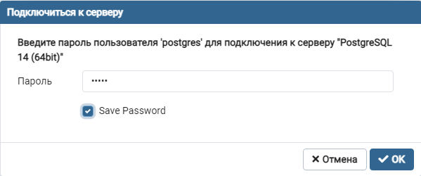

3. После ввода пароля, попадаем на основной экран pgAdmin

    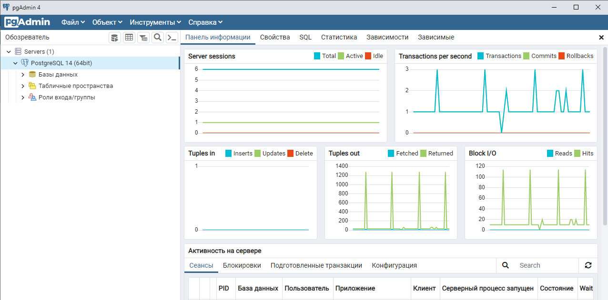

# Создание тестовой базы данных

Создадим тестовую базу данных. Для этого в pgAdmin ПКМ нажмем на пункт 
`Базы данных`, расположенный обозревателе. Затем перейдем в пункт контекстного
меню `Создать > База данных...`

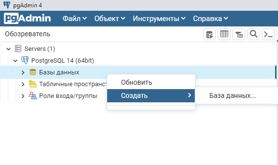

После перехода в пункт контекстного меню, откроется окно с параметрами создания 
базы данных. В данном окне укажем имя базы данных `test` и нажмем кнопку 
`Сохранить`. В результате будет создана база данных `test` и автоматически
выбрана в обозревателе серверов.

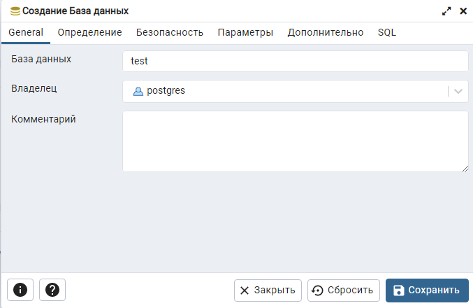

Далее откроем вкладку, на которой будем писать и выполнять SQL-команды для базы
данных `test`. В пункте меню выберем `Файл > Запросник`.

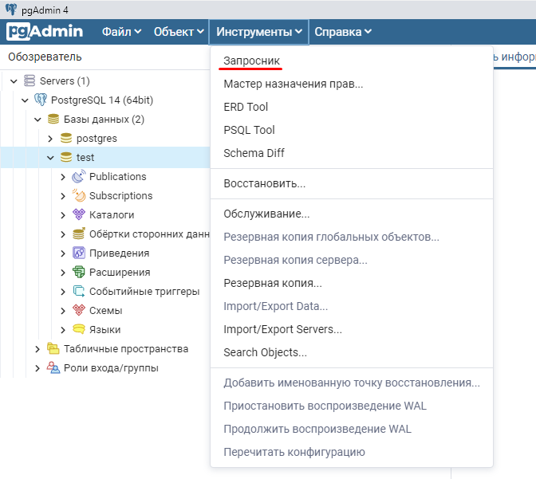

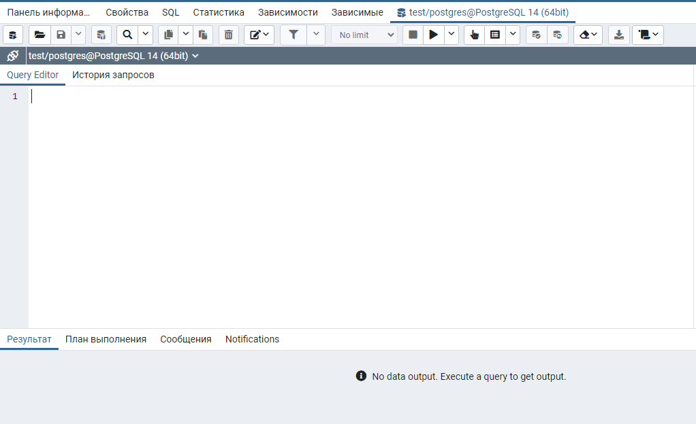

# Базовые типы данных

СУБД PostgreSQL поддерживает достаточно большое количество типов данных. В 
рамках наших занятий мы будем рассматривать только основные типы данных, которые
наиболее часто применяются на практике.

Список всех типов данных с детальным описанием можно найти на странице компании postgrespro: [Типы данных](https://postgrespro.ru/docs/postgresql/14/datatype).

Мы же рассмотрим только следующие типы данных:
    
1. Числовые типы
    
    1.1 Целочисленные типы

    1.2 Числа с произвольной точностью
    
    1.3 Типы с плавающей точкой
    
    1.4 Последовательные типы

2. Символьные типы

3. Типы даты/времени

## Числовые типы данных

### Целочисленные типы

Целочисленные типы данных представлены в таблице ниже. Наиболее используемым 
типом данных среди целочисленных является тип данных integer. Данный тип имеет 
достаточно широкий диапазон значений, которого хватает для большинства задач.


| Имя      | Размер  | Описание                       | Диапазон                                     |
|----------|---------|--------------------------------|----------------------------------------------|
| smallint | 2 байта | целое в небольшом диапазоне    | -32768 ... +32767                            |
| integer  | 4 байта | типичный выбор для целых чисел | -2147483648 ... +2147483647                  |
| bigint   | 8 байт  | целое в большом диапазоне      | -9223372036854775808 ... 9223372036854775807 |

### Числа с произвольной точностью

Числа с произвольной точностью используются, когда необходимо обеспечить 
точность вычислений, например, при операциях с денежными суммами. Однако, 
вычисления числами произвольной точности производятся медленнее, чем целыми 
числами или числами с плавающей точкой.

| Имя     | Размер     | Описание                                 | Диапазон                                                      |
|---------|------------|------------------------------------------|---------------------------------------------------------------|
| numeric | переменный | вещественное число с указанной точностью | до 131072 цифр до десятичной точки и до 16383 - после запятой |

Синтаксис типа данных числа с произвольной точностью имеет вид:

    NUMERIC(точность, масштаб)

Точность - это общее количество разрядов в числе. Масштаб - количество разрядов 
в числе после запятой.

Допускается не задавать масштаб числа с произвольной точностью. В этом случае 
масштаб по умолчанию будет равен нулю.

Если не задать точность и масштаб, то они будут равны пределам, установленным в 
postgres.

Пример. Допустим, мы хотим сохранить в базе данных число `1234.56`, тогда мы 
должны использовать тип `NUMERIC(6, 2)`.

### Типы с плавающей точкой

В PostgreSQL имеет два типа с плавающей точкой: `real` и `double precision`.
Эти типы данных реализованы в соответствии со стандартом IEEE 754. Вычисления с 
использованием этих типов данных не совсем точные. Поэтому, если важна точность,
то лучше использовать тип `numeric`.

| Имя              | Размер  | Описание                                  | Диапазон                               |
|------------------|---------|-------------------------------------------|----------------------------------------|
| real             | 4 байта | вещественное число с переменной точностью | точность в пределах 6 десятичных цифр  |
| double precision | 8 байт  | вещественное число с переменной точностью | точность в пределах 15 десятичных цифр |

### Последовательные типы

Последовательные типы данных представляют собой удобные средства для создания 
столбцов с уникальными значениями. Столбцы располагаются в таблицах (об этом 
расскажем позже).

| Имя         | Размер  | Описание                          | Диапазон                  |
|-------------|---------|-----------------------------------|---------------------------|
| smallserial | 2 байта | небольшое целое с автоувеличением | 1 ... 32767               |
| serial      | 4 байта | целое с автоувеличением           | 1 ... 2147483647          |
| bigserial   | 8 байт  | большое целое с автоувеличением   | 1 ... 9223372036854775807 |

## Символьные типы данных

Существует три основных символьных типа данных в PostgreSQL. Это `varchar(n)`, 
`char(n)` и `text`. n - это максимальное количество символов в строке переменной длины. 

| Имя        | Описание                                          |
|------------|---------------------------------------------------|
| varchar(n) | строка ограниченной переменной длины              |
| char(n)    | строка фиксированной длины, дополненная пробелами |
| text       | строка неограниченной переменной длины            |

## Типы даты/времени

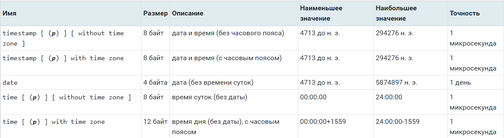

Типы time, timestamp принимают необязательное значение точности p, определяющее, 
сколько знаков после запятой должно сохраняться в секундах. По умолчанию 
точность не ограничивается. Допустимые значения p лежат в интервале от 0 до 6.

# Работа с таблицами

Основными объектами в реляционной базе данных являются таблицы. Именно в них 
происходит хранение данных. В данном разделе мы рассмотрим вопросы, связанные с
созданием и удалением таблиц в базе данных.

## Создание таблицы

Базовый синтаксис создания таблицы имеет следующий вид:

```sql
create table ИМЯ_ТАБЛИЦЫ (
    ИМЯ_СТОЛБЦА_1 ТИП_ДАННЫХ_СТОЛБЦА_1,
    ИМЯ_СТОЛБЦА_2 ТИП_ДАННЫХ_СТОЛБЦА_2,
    ...
    ИМЯ_СТОЛБЦА_N ТИП_ДАННЫХ_СТОЛБЦА_N
);
```

Пример. Пусть имеется таблица со списком факультетов разных университетов, 
которая содержит всего два столбца: `Название факультета`, 
`Название университета`.

Исходя из наименования столбцов ясно, что типом столбцов будет являться 
символьный тип данных. В качестве символьного типа данных лучше выбрать varchar
с ограничением по количеству символов для каждого столбца.

```sql
create table faculties (
    faculty    varchar(150),
    university varchar(500)
);
```

Скопируем данный код в редактор запросов pgAdmin и выполним его. Для этого 
нажмем `F5`. В окне сообщений видим, что таблица успешно создана.

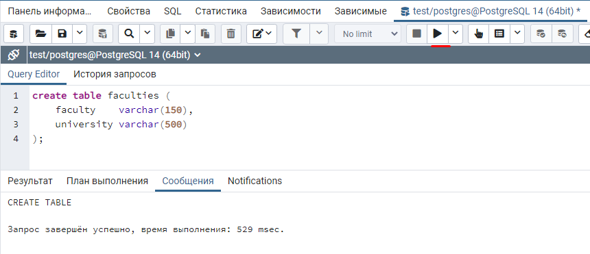

В обозревателе серверов таблица также присутствует.

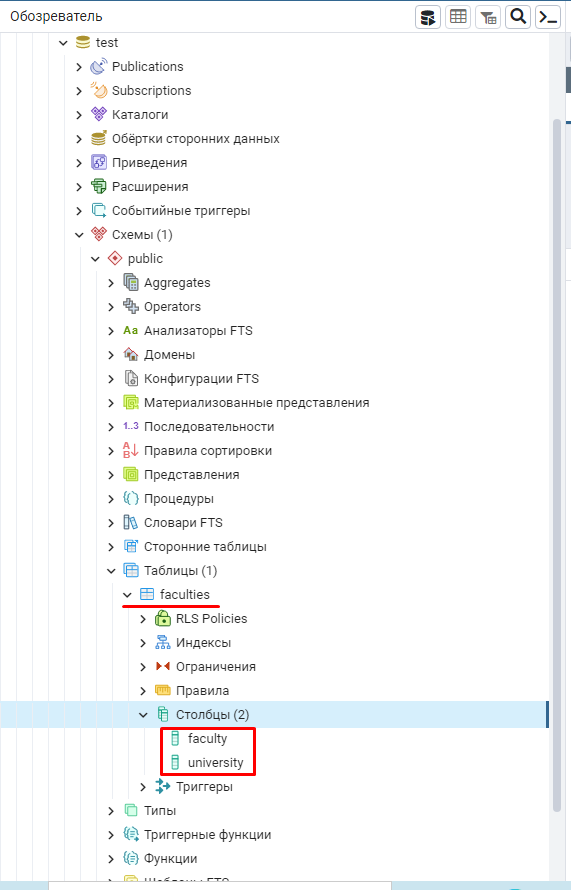

## Удаление таблицы

Для того, чтобы удалить таблицу необходимо воспользоваться командой

```sql
drop table ИМЯ_ТАБЛИЦЫ;
```

Удалим таблицу факультетов. Для этого выполним команду `drop table faculties;`.

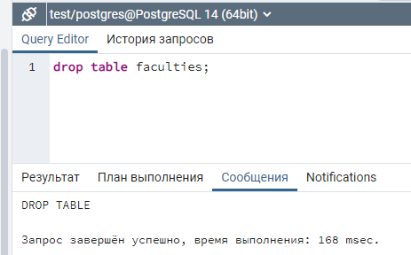

# Вставка, чтение, обновление, удаление данных из таблицы

Создадим таблицу студентов, в которой будут следующие поля: имя, фамилия, 
отчество. На основании данной таблицы покажем основные манипуляции с данными
при помощи языка SQL.

```sql
create table students (
    firstname varchar(50),
    surname   varchar(100),
    lastname  varchar(100)
);
```

# Вставка данных. Команда Insert

Синтаксис вставки данных в таблицу имеет следующий вид:

```sql
insert into ИМЯ_ТАБЛИЦЫ (НАЗВАНИЕ_СТОЛБЦА_1, НАЗВАНИЕ_СТОЛБЦА_2...)
values (ЗНАЧЕНИЕ_СТОЛБЦА_1, ЗНАЧЕНИЕ_СТОЛБЦА_2)
```

Отметим, что названия столбцов таблицы могут быть перечислены через запятую 
в любом порядке. Добавим одного студента. В списке столбцов укажем первым
столбец с фамилией студента `surname`, затем столбец с именем студента 
`firstname`, после столбец с отчеством `lastname`. При добавлении значений в 
секции `values`, фамилию, имя и отчество необходимо заключить в апострофы, так
как столбцы `surname`, `firstname`, `lastname` имеют строковый тип данных 
`varchar`.

```sql
insert into students (surname, firstname, lastname)
values ('Петров', 'Иван', 'Иванович');
```

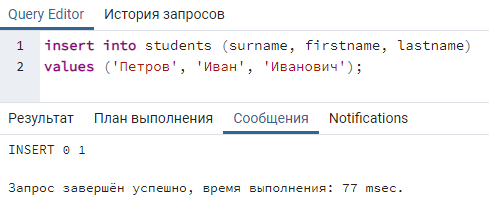

Если нам необходимо добавить за одну SQL-команду нескольких студентов, 
то это можно сделать при помощи следующей SQL-команды:

```sql
insert into students (surname, firstname, lastname)
values ('Сазанов',   'Кирилл',   'Олегович'),
       ('Алексеева', 'Дарья',    'Михайловна'),
       ('Иванова',   'Марина',   'Дмитриевна'),
       ('Лебедев',   'Сергей',   'Дмитриевич'),
       ('Фёдорова',  'Анна',     'Владимировна'),
       ('Иванова',   'Кристина', 'Дмитриевна');
```

Иногда встречаются ситуации, когда необязательно заполнять некоторые столбцы в 
таблице. Значения в данных столбцах должны остаться пустыми. Для того, чтобы
указать, что значение должно быть пустым, используется ключевое слово `null`.
Например, у иностранных студентов, может отсутствовать отчество. Добавим в 
качестве примера такого студента.

```sql
insert into students (surname, firstname, lastname)
values ('Brown', 'Mike', null);
```

## Чтение данных. Команда Select

После того, как все данные добавлены, попробуем эти данные считать из таблицы
`students`. Для чтения данных из таблицы используется SQL-команда `select`. 
Синтаксис запроса для чтения всех данных из таблицы имеет вид:

```sql
select СТОЛБЕЦ_ТАБЛИЦЫ_1,
       СТОЛБЕЦ_ТАБЛИЦЫ_2,
       ...
       СТОЛБЕЦ_ТАБЛИЦЫ_N
  from НАЗВАНИЕ_ТАБЛИЦЫ
```

В секции запроса `select` перечисляются через запятую столбцы, которые 
необходимо извлечь из таблицы. Столбцы могут быть перечислены в любом порядке. 
В секции `from` указывается таблица, откуда будут извлекаться данные. Секции 
`select` и `from` являются обязательными в запросе.

Считаем все данные из таблицы `students` при помощи запроса:

```sql
select firstname,
       surname,
       lastname
  from students
```

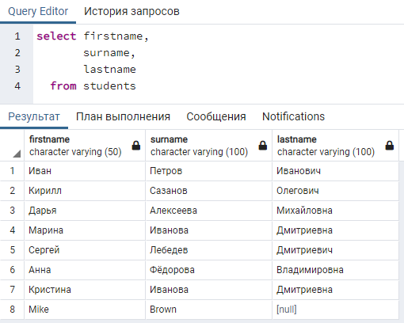

В секции запроса `select` необязательно указывать все столбцы, которые 
присутствуют в таблице. Можно указать, только те, которые нас интересуют. 
Например, из таблицы `students` можно получить только фамилии студентов.


Если необходимо получить данные из всех столбцов таблицы, то чтобы в 
секции `select` не перечислять все столбцы, можно указать просто `*`.

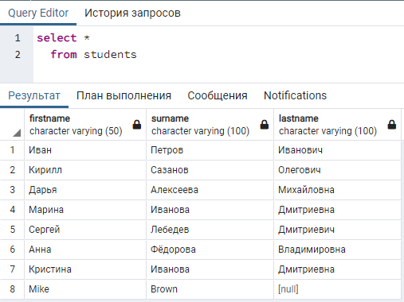

### Фильтрация данных

Предположим, что среди списка студентов необходимо найти студентку с фамилией
"Иванова". Для этого в запрос необходимо добавить еще одну секцию `where`. 
Данная секция предназначена для фильтрации строк в исходной таблице по указанным
условиям. Секция `where` в отличии от секций `select` и `from` необязательна.

```sql
select *
  from students
 where surname = 'Иванова'
```

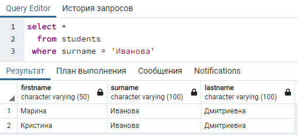

В секции `where` может находится как простое, так и составное логическое 
выражение. В качестве логических операторов используются следующие:

* логическое И - `and`
* логическое ИЛИ - `or`
* логическое отрицание - `not` или `!`

Кроме логических операторов в `where` используются операторы сравнения:

* больше - `>`
* меньше - `<`
* больше или равно - `>=`
* меньше или равно - `<=`
* равно - `=`
* не равно - `!=` или `<>`

Также в SQL присутствуют специальные операторы:

* `like`
* `beetwen`
* `in`
* `exists`

Рассмотрим еще один пример, в котором необходимо найти информацию о двух 
студентах: Сазаноне и Лебедеве. В этом случае, в секции where будет составное
логическое выражение:

```sql
select *
  from students
 where surname = 'Сазанов'
    or surname = 'Лебедев'
```

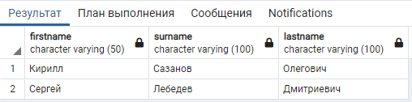

### Группировка данных

Помимо фильтрации данных одной из распространенных операций в языке SQL, 
является группировка данных. Для группировки данных используется оператор 
`group by`. Предположим, что необходимо вывести список неповторяющихся фамилий 
студентов. Для этого сгруппируем студентов по фамилии.

```sql
select surname
  from students
 group by surname
```

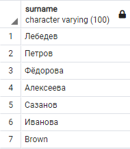

**Примечание.** После конструкции `group by` указывается список столбцов, по
которым осуществляется группировка. В секции запроса `select` необходимо
перечислять только те столбцы, которые присутствуют в секции `group by` - это
обязательное условие.

Можно произвести подсчет количества строк в рамках одной группы при помощи
агрегатной функции `count`. Данная функция работает только в паре с `group by`.

```sql
select surname,
       count(*)
  from students
 group by surname
```


### Сортировка данных

При извлечении данных из таблицы, можно указать способ сортировки данных при 
помощи оператора `order by`.

Отсортируем таблицу студентов по фамилии в алфавитном порядке (по возрастанию).

```sql
select *
  from students
 order by surname asc
```

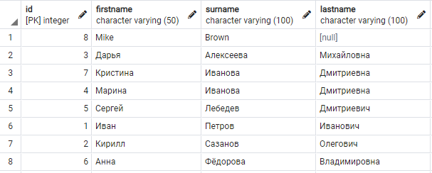

Отметим, что по умолчанию данные на английском языке выводятся раньше данных на
русском.

Изменим сортировку столбца `surname` на сортировку по убыванию.

```sql
select *
  from students
 order by surname desc
```
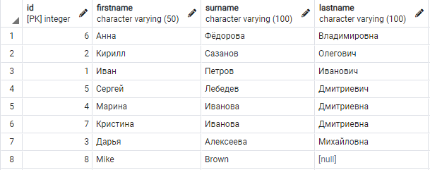

## Обновление данных. Команда Update

При работе информационных систем кроме добавления данных в таблицу, чтения 
данных из таблицы возникает потребность обновлять данные в некоторых строках 
таблицы. Для обновления данных в таблице в языке SQL используется команда 
UPDATE.
Синтаксис команды обновления в самом простом случае имеет вид:

```sql
update НАЗВАНИЕ_ТАБЛИЦЫ set
    СТОЛБЕЦ_1_ТАБЛИЦЫ = ЗНАЧЕНИЕ_1
    СТОЛБЕЦ_2_ТАБЛИЦЫ = ЗНАЧЕНИЕ_2
    ...
 where УСЛОВИЕ_ОТБОРА_СТРОК
```

Секция `where` команды `update` является необязательной. Если секцию `where` не 
указать, то данные обновятся во всех строках таблицы в рамках указанных столбцов
после ключевого слова `set`.

Приведем пример использования команды `update`. В результате ошибки при внесении данных отчество Петрова Ивана перепутали. Вместо "Александрович" записали как "Иванович". Произведем обновление отчества.

```sql
update students set
       lastname  = 'Александрович'
 where surname   = 'Петров'
   and firstname = 'Иван'
   and lastname  = 'Иванович'
```

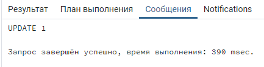

## Удаление данных. Команда Delete

Рано или поздно наступает момент, когда данные из таблиц необходимо удалить, 
ввиду их дальнейшей ненадобности. Чтобы удалить данные из таблицы, в SQL 
используется команда `delete`. Синтаксис команды имеет следующий вид:

```sql
delete from НАЗВАНИЕ_ТАБЛИЦЫ
 where УСЛОВИЕ_ОТБОРА_СТРОК
```

Секция `where` не является обязательной. Если `where` будет отсутствовать, то
из таблицы будут удалены все строки.

Приведем пример использования команды `delete`. Допустим, из таблицы необходимо
удалить студентку Фёдорову Анну "Владимировну.

```sql
delete from students
 where surname   = 'Фёдорова'
   and firstname = 'Анна'
   and lastname  = 'Владимировна'
```
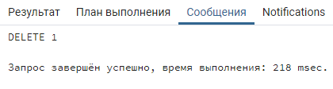

## Удаление всех данных из таблицы. Команда Truncate

Кроме команды `delete` без секции `where` удалить все строки из таблицы можно
при помощи команды `truncate`. Одним из главных отличий является то, что 
отменить удаление строк, для которых была применена команда `delete` можно, а
для команды `truncate` - нельзя. В связи с этим команда `truncate` работает 
быстрее `delete`.

Синтаксис команды `truncate` имеет следующий вид:

```sql
truncate table НАЗВАНИЕ_ТАБЛИЦЫ
```

# Ограничения целостности

Ограничения целостности задаются при создании таблицы следующим образом:

```sql
create table ИМЯ_ТАБЛИЦЫ (
    ИМЯ_СТОЛБЦА_1   ТИП_ДАННЫХ_СТОЛБЦА_1   ОГРАНИЧЕНИЕ_1   ОГРАНИЧЕНИЕ_2...,
    ИМЯ_СТОЛБЦА_2   ТИП_ДАННЫХ_СТОЛБЦА_2   ОГРАНИЧЕНИЕ_1   ОГРАНИЧЕНИЕ_2...,
    ...
    ИМЯ_СТОЛБЦА_N   ТИП_ДАННЫХ_СТОЛБЦА_N   ОГРАНИЧЕНИЕ_1   ОГРАНИЧЕНИЕ_2...
);
```

## Первичный ключ. Primary Key

Предположим, что в одном университете учатся два студента с одинаковой фамилией,
именем и отчеством. Соответственно, в таблице `students` будут находиться две
совершенно одинаковые строки. Рассмотрим ситуацию, когда одного из студентов 
отчисляют и запись из таблицы студентов необходимо удалить. Но тут возникает
проблема связанная с тем, что при удалении из таблицы пропадут обе записи. 
Это недопустимо.  Для избежания подобных проблем было бы неплохо, чтобы в таблице 
появился столбец, в котором находились только уникальные значения, например, 
числовые номера. Данные уникальные значения однозначно идентифицируют строки
таблицы, а значит и студентов. По номеру студента можно однозначно удалить
строку с его данными из таблицы `students`. Такие уникальные значения называются
`первичными ключами` (primary keys) или `идентификаторами`.

Пересоздадим таблицу `students`, добавив новый столбец `id`, который будет 
являться первичным ключом. Для столбца `id` укажем тип данных `serial`. В таком 
случае, при добавлении данных в таблицу не будет необходимости указывать в 
`insert` столбец `id`, так как значения для данного столбца будут генерироваться
автоматически.

```sql
create table students (
    id        serial primary key,
    firstname varchar(50),
    surname   varchar(100),
    lastname  varchar(100)
);
```

Наполним таблицу `students` данными. При этом в списке столбцов команды `insert`
не будем указывать столбец `id`.

```sql
insert into students (surname, firstname, lastname)
values ('Петров',    'Иван',     'Иванович'),
       ('Сазанов',   'Кирилл',   'Олегович'),
       ('Алексеева', 'Дарья',    'Михайловна'),
       ('Иванова',   'Марина',   'Дмитриевна'),
       ('Лебедев',   'Сергей',   'Дмитриевич'),
       ('Фёдорова',  'Анна',     'Владимировна'),
       ('Иванова',   'Кристина', 'Дмитриевна'),
       ('Brown',     'Mike',      null);
```
Результат добавления строк в таблицу `students` представлен ниже. Из рисунка 
видим, что для каждой записи в таблице сгенерировался уникальный идентификатор
в столбце `id`.

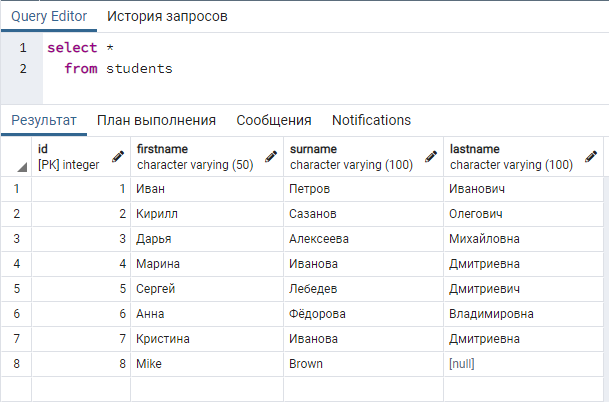

На начальном этапе изучения SQL, необходимо запомнить некоторые факты, связанные
с первичными ключами:
* первичные ключи уникальны: в таблице не может быть двух строк с одинаковыми
первичными ключами;
* первичные ключи не могут быть null.

При нарушении приведенных правил, система управления базами данных выдаст 
ошибку.

Попробуем добавить нового студента с `id` равным 5. Данный `id` уже присутствует
в таблице.

```sql
insert into students (id, surname, firstname, lastname)
values (5, 'Гаврилов', 'Алексей', 'Иванович')
```

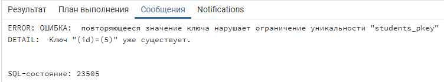

Теперь попробуем добавить в качестве первичного ключе значение `null`.

```sql
insert into students (id, surname, firstname, lastname)
values (null, 'Гаврилов', 'Алексей', 'Иванович')
```

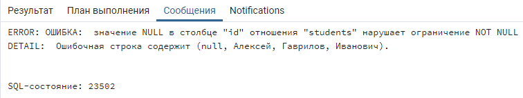

## Ограничение not null

На текущий момент в таблицу `students` можно добавить студентов, у которых,
например, не будут заполнены поля фамилия или имя, или всё сразу. Пропуск
отчества допустим, так как его, например, нет у иностранных студентов. Пропуск
фамилии и имени недопустим. Для того, чтобы запретить пользователям добавлять
студентов без фамилии, необходимо наложить на столбец `surname` ограничение 
`not null`. Данное ограничение не позволяет добавлять пустые `null` значения
в указанный столбец.

Пересоздадим таблицу `students`, добавив ограничения `not null` для столбцов
с фамилией `surname` и именем `firstname`.

```sql
create table students (
    id        serial       primary key,
    firstname varchar(50)  not null,
    surname   varchar(100) not null,
    lastname  varchar(100)
);
```

После создания таблицы попробуем добавить студента, у которого не заполнена
фамилия. Возникнет ошибка.

```sql
insert into students (surname, firstname, lastname)
values (null, 'Алексей', 'Иванович')
```

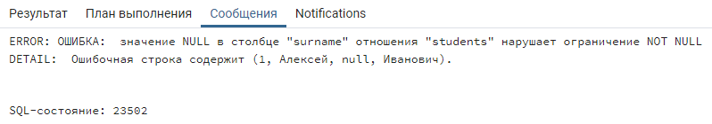

При создании таблиц необходимо помнить, что если не указать ограничение 
`not null`, то столбец может содержать пустые значения.

## Ограничение unique

Рассмотрим ситуацию, когда кроме информации о ФИО студентов в таблице 
`students` необходимо хранить серию и номер паспорта студента. На данные поля
также необходимо наложить ограничения `not null`.

Как известно, серия и номер паспорта уникальны для каждого человека. Поэтому,
если мы не наложим ограничения, то в таблицу `students` можно будет добавить
записи с одинаковыми серией и номером. Чтобы избежать данной ситуации, 
необходимо наложить ограничение уникальности `unique` на пару столбцов 
`ser_passport` и `num_passport`. При этом в отдельных столбцах `ser_passport` и
 `num_passport` значения могут повторяться, но данная пара в совокупности будет
 уникальна для всех строк.

 Синтаксис добавления ограничения `unique` для пары столбцов имеет следующий 
 вид:

```sql
create table students (
    id           serial       primary key,
    firstname    varchar(50)  not null,
    surname      varchar(100) not null,
    lastname     varchar(100),
    ser_passport varchar(4)   not null,
    num_passport varchar(6)   not null,
    unique(ser_passport, num_passport)
);
```

Добавим в таблицу данные об одном студенте:

```sql
insert into students (surname, firstname, lastname, ser_passport, num_passport)
values ('Романов', 'Сергей', 'Иванович', '0897', '556677')
```

Попробуем добавить студента с такой же серией и номером паспорта:

```sql
insert into students (surname, firstname, lastname, ser_passport, num_passport)
values ('Алексеев', 'Артём', 'Олегович', '0897', '556677')
```

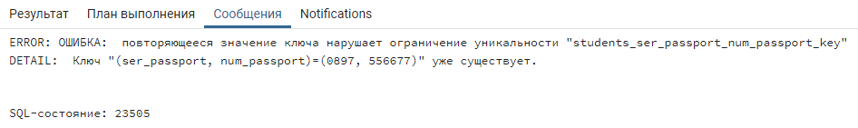

## Ограничения проверки. Checks

В предыдущем пункте про ограничение `unique` в таблицу `students` были 
добавлены столбцы с серией и номером паспорта. В серии паспорта указываются 4
цифры, в номере указываются 6 цифр. На текущий момент, в данные поля можно 
добавить серию с количеством цифр меньше четырех и номер с количеством цифр
меньше шести. Чтобы избежать подобных ошибок, можно указать СУБД при вставке 
данных в таблицу `students` выполнялась проверка на количество символов в 
строках `ser_passport` и `num_passport`. Подсчет символов в строке можно 
выполнить при помощи функции `char_length`.

Пересоздадим таблицу `students`, добавив проверки для столбцов с серией и 
номером.

```sql
create table students (
    id           serial       primary key,
    firstname    varchar(50)  not null,
    surname      varchar(100) not null,
    lastname     varchar(100),
    ser_passport varchar(4)   not null check(char_length(ser_passport) = 4),
    num_passport varchar(6)   not null check(char_length(num_passport) = 6),
    unique(ser_passport, num_passport)
);
```

Добавим студента, у которого корректное количество символов в серии и номере
паспорта:

```sql
insert into students (surname, firstname, lastname, ser_passport, num_passport)
values ('Алексеев', 'Артём', 'Олегович', '0897', '556677')
```

Теперь попробуем добавить студента, у которого три цифры в серии:
```sql
insert into students (surname, firstname, lastname, ser_passport, num_passport)
values ('Краснов', 'Олег', 'Петрович', '123', '445566')
```

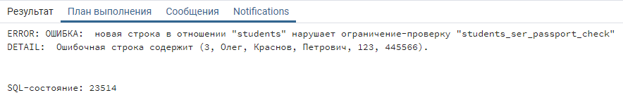

# Внешний ключ. Foreign Key

Продолжим дорабатывать таблицу `students`. Добавим столбец группы в таблицу 
студентов и заполним произвольными данными.

|id | surname   | firstname | lastname     | ser_passport | num_passport | group  |
|---|-----------|-----------|--------------|--------------|--------------|--------|
| 1 | Петров    | Иван      | Иванович     | 0074         | 892303       | КЭ-111 |
| 2 | Сазанов   | Кирилл    | Олегович     | 0023         | 762932       | ЕТ-235 |
| 3 | Алексеева | Дарья     | Михайловна   | 1299         | 877123       | ЕТ-235 |
| 4 | Иванова   | Марина    | Дмитриевна   | 1133         | 098786       | МБ-320 |
| 5 | Лебедев   | Сергей    | Дмитриевич   | 4432         | 987651       | КЭ-111 |
| 6 | Фёдорова  | Анна      | Владимировна | 9988         | 767512       | МБ-320 |
| 7 | Иванова   | Кристина  | Дмитриевна   | 7722         | 897612       | МБ-320 |
| 8 | Brown     | Mike      | null         | 7312         | 112342       | ЕТ-235 |

Из представленной таблицы видим, что в каждой группе состоит несколько 
студентов. Предположим, что в университете установлено правило, согласно 
которому первая цифра номера группы равна номеру курса студентов. По истечении
академического года студенты переходят на следующий курс, а первая цифра номера
группы увеличивается на единицу. В таком случае, каждый год необходимо 
обновлять поле `group` во всех строках таблицы `students`. Представленный подход 
к организации данных не является оптимальным, так как данных в таблице `students`
может содержаться много и процесс обновления может занимать длительный 
промежуток времени. Решением представленной проблемы служит разбиение данных
из таблицы `students` на две таблицы `students` и `groups`.

Таблица `groups`:

|id | group_name |
|---|------------|
| 1 | КЭ-111     |
| 2 | ЕТ-235     |
| 3 | МБ-320     |

Таблица `students`:

|id | surname   | firstname | lastname     | ser_passport | num_passport | group_id |
|---|-----------|-----------|--------------|--------------|--------------|----------|
| 1 | Петров    | Иван      | Иванович     | 0074         | 892303       | 1        |
| 2 | Сазанов   | Кирилл    | Олегович     | 0023         | 762932       | 2        |
| 3 | Алексеева | Дарья     | Михайловна   | 1299         | 877123       | 2        |
| 4 | Иванова   | Марина    | Дмитриевна   | 1133         | 098786       | 3        |
| 5 | Лебедев   | Сергей    | Дмитриевич   | 4432         | 987651       | 1        |
| 6 | Фёдорова  | Анна      | Владимировна | 9988         | 767512       | 3        |
| 7 | Иванова   | Кристина  | Дмитриевна   | 7722         | 897612       | 3        |
| 8 | Brown     | Mike      | null         | 7312         | 112342       | 2        |

В таком виде таблицы `students` и `groups` связаны при помощи идентификаторов
таблицы `groups`. Данные идентификаторы в столбце `group_id` таблицы `students`
называются `внешними ключами`.

Таким образом, чтобы обновить номер группы достаточно обновить одну строку в
таблице `groups`. При этом `group_id` в таблице `students` не изменится.

При этом, если не делать никаких дополнительных действий в таблице `students`,
то в столбец `group_id` можно будет добавить идентификаторы, которых не будет в
таблице `groups`. Чтобы этого избежать необходимо на столбец `group_id` наложить
ограничение внешнего ключа. Ниже представлен пример синтаксиса с ограничением
внешнего ключа.

```sql
create table groups (
    id         serial       primary key,
    group_name varchar(30)  not null
);
```

```sql
create table students (
    id           serial       primary key,
    firstname    varchar(50)  not null,
    surname      varchar(100) not null,
    lastname     varchar(100),
    ser_passport varchar(4)   not null check(char_length(ser_passport) = 4),
    num_passport varchar(6)   not null check(char_length(num_passport) = 6),
    group_id     serial       not null references groups (id),
    unique(ser_passport, num_passport)
);
```

Чтобы наложить ограничение внешнего ключа для определенного столбца, необходимо
написать ключевое слово `references`. Затем указывается название таблицы, 
содержащей столбец, который будет связан столбец текущей таблицы. После названия
таблицы в круглых скобках указывается столбец этой таблицы.

```sql
references groups (id)
```

Необходимо отметить, что таблицу `groups` необходимо создавать раньше таблицы
`students`, так как столбец `students` связан со столбцом `groups` при помощи
ограничения внешнего ключа.

Добавим данные в таблицы:

```sql
insert into groups (group_name)
values ('КЭ-111'),
       ('ЕТ-235'),
       ('МБ-320')
```

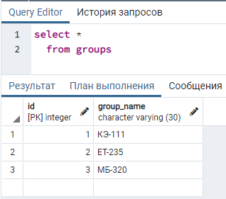

```sql
insert into students (surname, firstname, lastname, ser_passport, num_passport, group_id)
values ('Петров',    'Иван',     'Иванович',     '0074', '892303', 1),
       ('Сазанов',   'Кирилл',   'Олегович',     '0023', '762932', 2),
       ('Алексеева', 'Дарья',    'Михайловна',   '1299', '877123', 2),
       ('Иванова',   'Марина',   'Дмитриевна',   '1133', '098786', 3),
       ('Лебедев',   'Сергей',   'Дмитриевич',   '4432', '987651', 1),
       ('Фёдорова',  'Анна',     'Владимировна', '9988', '767512', 3),
       ('Иванова',   'Кристина', 'Дмитриевна',   '7722', '897612', 3),
       ('Brown',     'Mike',      null,          '7312', '112342', 2);
```

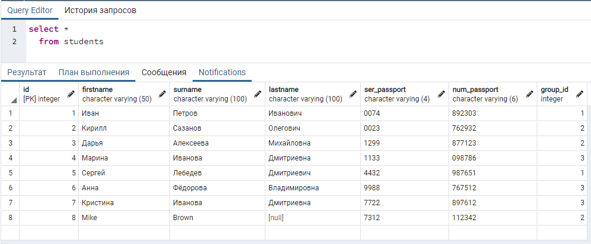

Алгоритм соединения таблиц по внешнему ключу будет рассмотрен далее.

# Логическое соединение таблиц

В предыдущем пункте про ограничение внешнего ключа мы разбили таблицу `students` 
на две части. Чтобы соединить таблицы, в языке SQL предусмотрены специальные 
логические операторы соединения таблиц, которые мы рассмотрим в данном разделе.

Создадим таблицу факультативов, на которые записаны студенты. На примере данной
таблицы и таблицы `students` будем демонстрировать различные соединения таблиц.

```sql
create table electives (
    id         serial       primary key,
    elective   varchar(250) not null,
    student_id integer      references students (id)
);
```

**Примечание.** В таблице `electives` тип данных столбца `student_id` отличается 
от типа данных столбца `id` таблицы `students`. Это сделано намеренно, чтобы 
продемонстрировать возможность добавления `null` значений в столбцы внешнего 
ключа. Тип данных `serial` не позволяет добавить `null` значение в столбец.

Допустим, что следующие студенты посещают факультативы:

|id | Фамилия   | Имя       | Отчество     | Название факультатива |
|---|-----------|-----------|--------------|-----------------------|
| 2 | Сазанов   | Кирилл    | Олегович     | Шахматы               |
| 3 | Алексеева | Дарья     | Михайловна   | Немецкий язык         |
| 5 | Лебедев   | Сергей    | Дмитриевич   | Курс по SQL           |
| 6 | Фёдорова  | Анна      | Владимировна | Теннис                |

Заполним таблицу факультативов:

```sql
insert into electives (elective, student_id)
values ('Шахматы',       2),
       ('Немецкий язык', 3),
       ('Курс по SQL',   5),
       ('Теннис',        6);
```

В связи с тем, что на столбец `student_id` таблицы `electives` не наложено 
ограничения `not null`, в данную таблицу можно добавить факультативы, на 
которые не записан не один из студентов.

```sql
insert into electives (elective, student_id)
values ('Японский язык', null);
```

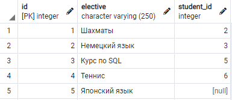

## Внутреннее соединение таблиц. Inner Join

Начнем рассмотрение способов соединения таблиц с одного из двух наиболее 
распространенных - `inner join`. Соединим две таблицы `students` и `electives`
при помощи внутреннего соединения. Отметим, что ключевое слово `inner` можно не
указывать в запросе, так как оно является необязательным.

```sql
select *
  from students  as st
  join electives as el on el.student_id = st.id
```
В секции запроса `from` сначала указывается первая таблица `students`, которой 
задается псевдоним `st` при помощи конструкции `as st`. Затем указывается 
ключевое слово `join`. После `join` указывается вторая таблица `electives`, 
которой задается псевдоним `el`. После псевдонима `el` указывается обязательное 
ключевое слово `on`. И, наконец, после `on` указывается условие соединения 
таблиц. Условием соединения таблиц может служить любое логическое выражение. 
Наиболее распространенным логическим выражением является связь таблиц по 
внешнему ключу.

При соединении таблиц для каждой таблицы задается псевдоним. Это делается для 
однозначного определения принадлежности того или иного столбца к определенной 
таблице. Так как названия столбцов в таблицах могут повторяться.

Порядок следования таблиц для внутреннего соединения не имеет значения. В 
результирующей выборке будут находиться все столбцы первой и второй таблиц, но,
при этом, в выборке будут присутствовать только те строки, которые удовлетворяют
условию соединения.

Результат соединения представлен на рисунке:

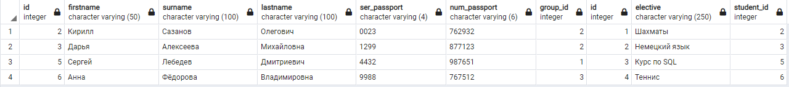

При соединении таблиц необязательно получать все столбцы двух таблиц. Можно 
выбрать только те, которые необходимы.

```sql
select st.surname,
       st.firstname,
       st.lastname,
       el.elective
  from students  as st
  join electives as el on el.student_id = st.id
```

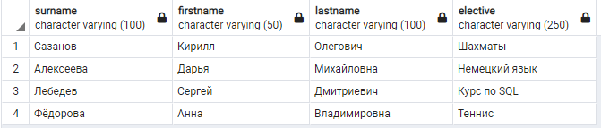

## Левое внешнее соединение. Left Outer Join

Левое внешнее соединение - это второе распространенное соединение.
Данный тип соединения зависит от расположения таблиц относительно оператора
`left join`. В результирующую выборку попадают все столбцы обеих таблиц. Отбор
строк для результирующей выборки производится по алгоритму:

1. сначала включаются все строки, которые удовлетворяют внутреннему соединению
таблиц;
2. в результирующую выборку добавляются строки из левой таблицы, которые не
удовлетворяют внутреннему соединению, а данные в столбцах правой таблицы 
для таких строк заполняются `null`.

Ключевое слово `outer` можно не указывать при соединении таблиц.

Приведем пример использования оператора `left join`.

```sql
select *
  from students as st
  left join electives as el on el.student_id = st.id
```

В данном примере таблица `students` является левой таблицей, а `electives` -
правой.

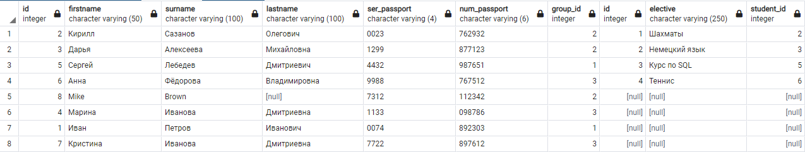

Попробуем поменять таблицы местами. Как видим из рисунка ниже, результат 
соединения изменился.

```sql
select *
  from electives as el 
  left join students as st on el.student_id = st.id
```

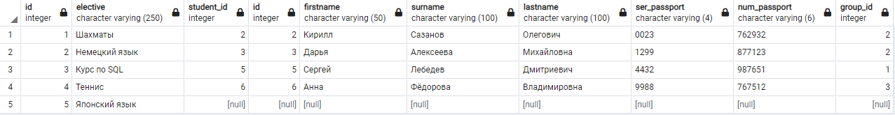

## Правое внешнее соединение. Right Outer Join

Данный тип соединения также зависит от расположения таблиц относительно 
оператора `right join`. В результирующую выборку попадают все столбцы обеих 
таблиц. Отбор строк для результирующей выборки производится по алгоритму:

1. сначала включаются все строки, которые удовлетворяют внутреннему соединению
таблиц;
2. в результирующую выборку добавляются строки из правой таблицы, которые не
удовлетворяют внутреннему соединению, а данные в столбцах левой таблицы 
для таких строк заполняются `null`.

```sql
select *
  from students as st
 right join electives as el on el.student_id = st.id
```

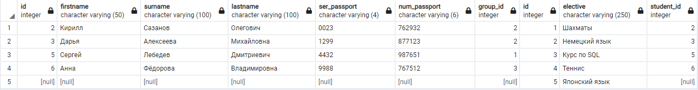

Поменяем таблицы местами.

```sql
select *
  from electives as el
 right join students as st on el.student_id = st.id
```

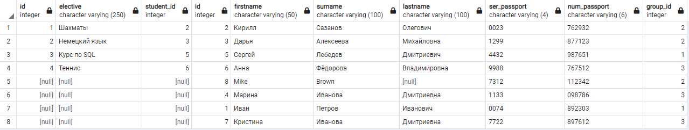

## Полное внешнее соединение. Full Outer Join

Полное внешнее соединение достаточно редко используется в практической 
деятельности. Данный тип соединения не зависит от расположения таблиц. В 
результирующую выборку попадают все столбцы обеих таблиц. Отбор строк для 
результирующей выборки производится по алгоритму:

1. сначала включаются все строки, которые удовлетворяют внутреннему соединению
таблиц;
2. в результирующую выборку добавляются строки из левой таблицы, которые не
удовлетворяют внутреннему соединению, а данные в столбцах правой таблицы 
для таких строк заполняются `null`.
3. в результирующую выборку добавляются строки из правой таблицы, которые не
удовлетворяют внутреннему соединению, а данные в столбцах левой таблицы 
для таких строк заполняются `null`.

```sql
select *
  from students as st
  full join electives as el on el.student_id = st.id
```

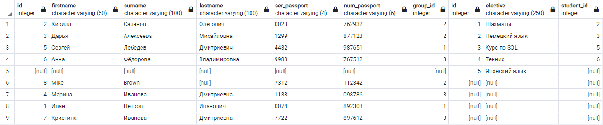

## Перекрестное соединение. Cross Join

Перекрестное соединение также редко используется на практике. Данный тип 
соединения не зависит от расположения таблиц. В результирующую выборку попадают
все столбцы из обеих таблиц. Строки соединяются по следующему алгоритму: каждая
строка первой таблицы соединяется со всеми строками второй таблицы.

Так в таблице `students` всего 8 строк, а в таблице `electives` 5 строк, то
в результирующей выборке будет 40 строк.

```sql
select *
  from students as st
 cross join electives as el
```

Покажем часть результата перекрестного соединения, чтобы понять общую логику.

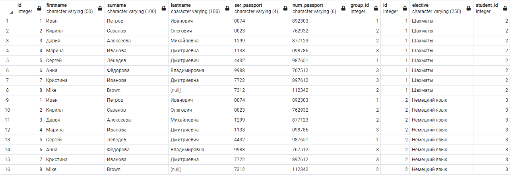

Альтернативный синтаксис перекрестного соединения:

```sql
select *
  from students  as st,
       electives as el
```