# Оглавление

1. [Что такое HTML?](#что-такое-html)

2. [Базовая структура HTML-страницы](#базовая-структура-html-страницы)

3. [Наиболее распространенные виды тегов](#наиболее-распространенные-виды-тегов)

4. [Базовые теги](#базовые-теги)

    4.1 [Теги контейнеры div и span](#теги-контейнеры-div-и-span)

    4.2 [Теги заголовков и абзацев](#теги-заголовков-и-абзацев)

    4.2 [Теги списков](#теги-списков)

    4.3 [Теги таблиц](#теги-таблиц)

    4.4 [Тег input](#тег-input)

    4.5 [Гиперссылки](#гиперссылки)

5. [Что такое CSS?](#что-такое-css)

6. [Виды CSS-селекторов](#виды-css-селекторов)

# Что такое HTML?

HTML (HyperText Markup Language) - это язык гипертекстовой разметки, который 
предназначен для создания документов (HTML-страниц), отображаемых на клиенте,
в частности - в браузере. HTML отвечает за логическую структуру документа.

Для создания веб-документа, использующего HTML в качестве разметки, используется
расширение файлов `.html`.

Составляющими документа HTML являются HTML-элементы. HTML-элементы 
подразделяются на несколько типов:

* пустые элементы (void elements);
* элемент `template`;
* элементы с неформатированным текстом (raw text elements);
* расширяемые элементы с неформатированным текстом (escapable raw 
text elements);
* внешние элементы (foreign elements);
* стандартные элементы (normal elements).

В практической деятельности наиболее часто используются стандартные 
HTML-элементы, поэтому данным элементам будет посвящена основная часть 
материала.

Чтобы разграничить HTML-элементы в документе используют открывающие и 
закрывающие теги. Под тегом следует понимать некоторую метку в документе, на 
основании которой можно однозначно определить HTML-элемент. Каждый тег имеет 
определенное назначение - семантическую нагрузку.

Пример HTML-элемента `p` с открывающим и закрывающим тегом:

```html
<p>Текст</p>
```

Тег `<p>` - открывающий, а `</p>` - закрывающий. `p` - это название тега. Между
открывающим и закрывающим тегом может находится текст или другие вложенные теги.
Открывающие и закрывающие теги определенных HTML-элементов могут отсутствовать.

Пример HTML-элемента с одним открывающим тегом: `<br>`.

Также у тегов имеются атрибуты, которые предоставляют дополнительную информацию
об HTML-элементе. Приведем пример атрибутов для элемента `p`:

```html
<p id="unique" class="paragraph">Текст</p>
```

Атрибуты указываются в открывающем теге. Если имеется несколько атрибутов, то 
они перечисляются через пробел. Значения атрибутов заключаются в двойные кавычки.
Существуют атрибуты, которые не имеют значений. В таком случае, пишется просто
название атрибута. 

Определенные HTML-элементы имеют атрибуты, которые предназначены именно для 
данного элемента. Некоторые атрибуты можно использовать практически во всех 
HTML-элементах. Такими атрибутами являются `id`, `class`.

`id` - это атрибут, в котором указывается уникальный идентификатор элемента в 
рамках страницы. По данному идентификатору можно будет получить доступ к 
элементу из `JavaScript'а` или `CSS`.

`class` - это атрибут, в котором задаются классы стилей CSS применяемых к 
элементу. Классы стилей перечисляются через пробел.

Некоторые элементы содержат атрибуты со значением по умолчанию. В таком случае,
если необходимо оставить значение по умолчанию, то атрибут в теге можно не 
прописывать.

# Базовая структура HTML-страницы

Рассмотрим базовую структуру любой HTML-страницы. Откроем файл `index.html` в 
нашем проекте, удалим весь имеющийся текст и вставим следующий код:

```html
<!DOCTYPE html>

<html>
  <head>
    <title>Document</title>
  </head>
  <body>
      
  </body>
</html>
```

Сохраним файл `index.html` и откроем браузере. Должна открыться пустая страница.

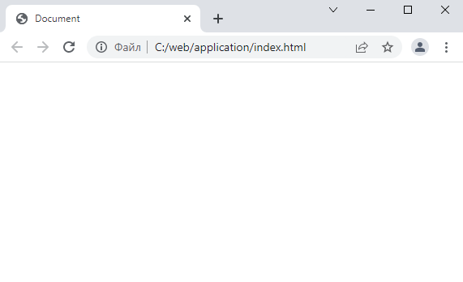

Все HTML-документы должны начинаться с декларирования типа документа при помощи
ключевого слова `DOCTYPE`. Это необходимо для того, чтобы браузер правильно 
интерпретировал документ. Существует несколько версий HTML. На текущий момент 
последней рекомендованной к использованию версией является пятая версия HTML 
(сокращенно HTML5). Спецификация HTML5 появилась в 2014 году. Чтобы указать 
браузеру, что необходимо использовать пятую версию HTML, следует в начале 
документа поместить строку `<!DOCTYPE html>`. Если необходимо использовать 
другие версии HTML, отличные от пятой, то синтаксис `DOCTYPE` можно посмотреть
на сайте [W3 консорциума](https://www.w3.org/QA/2002/04/valid-dtd-list.html). 
Также отметим, что `DOCTYPE` - это служебное ключевое слово, которое не является
тегом HTML.

Главным тегом HTML-страницы, в который вложены все остальные теги, является тег 
`html`. Данный тег может встречаться на странице только один раз. В тег `html`
вложены теги `head` и `body`.

тег `head` является контейнером для тегов, которые содержат метаинформацию об 
html-странице, подключают файлы со стилями документа и скриптами, написанными
на `JavaScript`. В теге `body` содержится контент страницы.

В теге `head` содержится тег `title`, который предназначен для задания 
заголовка HTML-страницы во вкладке браузера.

В браузере возможно посмотреть структуру открытой HTML-страницы. Для этого в 
браузере `Chrome` откроем инструменты разработчика, нажав клавишу `F12`. В
открывшемся окне перейдем на вкладку `Элементы`. Кликнув на определенный тег,
можно увидеть заданные для этого тега стили. Стили мы рассмотрим позднее.

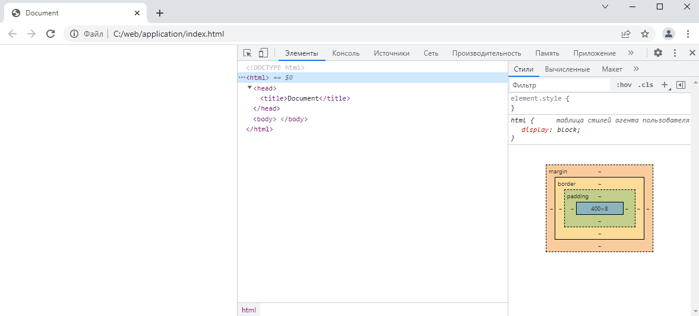

# Наиболее распространенные виды тегов

Для дальнейшей работы с HTML необходимо понимать на начальном этапе основные
виды тегов.

теги бывают `парными` и `одинарными` (самозакрывающимися). Парные теги - это теги,
которые имеют открывающий и закрывающий тег. Самозакрывающиеся теги имеют только
открывающий тег. О данных тегах упоминалось вначале материала.

По способу отображения в браузере теги подразделяют на `блочные` и `строчные`.
Блочные теги по умолчанию растягиваются на всю ширину страницы или родителя, а
высота тегов зависит от содержимого. Поэтому блочные теги располагаются по 
вертикали, если не заданы какие-либо специальные стили. Ширина и высота строчных 
тегов зависит от содержимого. Поэтому, по умолчанию строчные теги располагаются
в одной строке.

Метатеги предназначены для добавления метаинформации о странице и располагаются
в теге `head`.

# Базовые теги

Для демонстрации внешнего вида тегов будем последовательно добавлять в тег 
`body` рассматриваемые теги.

## Теги контейнеры div и span

Наиболее распространенными тегами на большинстве сайтов являются теги `div` и 
`span`. Данные теги предназначены для логического деления HTML-страницы на 
части и служат контейнерами для остальных тегов. тег `div` является блочным, а 
`span` - строчным.

```html
<div>тег div №1</div>
<div>тег div №2</div>
<div>тег div №3</div>

<span>тег span №1</span>
<span>тег span №2</span>
<span>тег span №3</span>
```

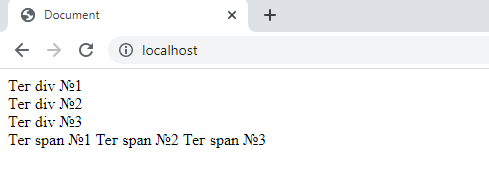

## Теги заголовков и абзацев

Для обозначения заголовков в тексте используются теги `h1`, `h2`, `h3`, `h4`,
`h5`, `h6`. `h1` - это заголовок первого уровня, `h6`, соответственно, шестого
уровня. теги заголовков являются блочными элементами.

```html
<h1>Заголовок первого уровня</h1>
<h2>Заголовок второго уровня</h2>
<h3>Заголовок третьего уровня</h3>
<h4>Заголовок четвертого уровня</h4>
<h5>Заголовок пятого уровня</h5>
<h6>Заголовок шестого уровня</h6>
```

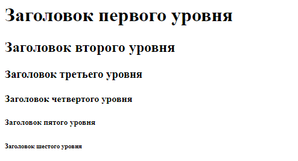

Для создания абзацев в тексте используется блочный тег `p`.

```html
<p>Абзац текста №1</p>
<p>Абзац текста №2</p>
<p>Абзац текста №3</p>
```

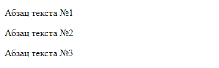

## Теги списков

В HTML присутствует три типа списков: маркированный, нумерованный, список 
определений.

Маркированный список задается при помощи тега `ul` (unordered list). Элементы
списка задаются при помощи тега `li` (list item). тег `ul` является блочным 
элементом.

тег `ul` имеет атрибут `type`, который может принимать значения `disc` - 
закрашенный кружок, `circle` - окружность, `square` - закрашенный квадрат. По
умолчанию атрибут `type` принимает значение `disc`.

Маркированный список с типом `disc` по умолчанию.

```html
<ul>
  <li>Первый элемент</li>
  <li>Второй элемент</li>
  <li>Третий элемент</li>
</ul>
```
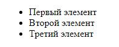

Маркированный список с типом `circle`.

```html
<ul type="circle">
  <li>Первый элемент</li>
  <li>Второй элемент</li>
  <li>Третий элемент</li>
</ul>
```

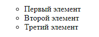

Маркированный список с типом `square`.

```html
<ul type="square">
  <li>Первый элемент</li>
  <li>Второй элемент</li>
  <li>Третий элемент</li>
</ul>
```

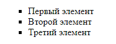

Нумерованный список задается при помощи блочного тега `ol` (ordered list).
Элементы списка задаются также при помощи тега `li`.

тег `ol` имеет атрибут `type`, который может принимать значения `1` - 
использовать числа при нумерации, `a` - использовать строчные латинские буквы, 
`A` - использовать прописные латинские буквы, `i` - использовать строчные 
римские числа, `I` - использовать прописные римские числа. По умолчанию атрибут 
`type` принимает значение `1`.

Нумерованный список с типом `1` по умолчанию.

```html
<ol>
  <li>Первый элемент</li>
  <li>Второй элемент</li>
  <li>Третий элемент</li>
</ol>
```

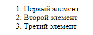

Нумерованный список с типом `I`.

```html
<ol type="I">
  <li>Первый элемент</li>
  <li>Второй элемент</li>
  <li>Третий элемент</li>
</ol>
```

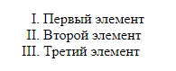

Список определений задается при помощи блочного тега `dl` (definition list). 
Элементы списка определений задаются тегами `dt` и `dd`. тег `dt` (definition 
term) используется для выделения описываемого термина. тег `dd` (definition 
description) служит для описания термина. Приведем пример.

```html
<dl>
  <dt>Бит</dt>
  <dd>единица измерения количества информации.</dd>
  
  <dt>HTML</dt>
  <dd>язык гипертекстовой разметки.</dd>
</dl>
```

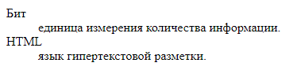

## Теги таблиц

Для создания таблицы при помощи HTML используется блочный тег `table`. Таблица 
в HTML делится на три области: заголовок, тело таблицы, подвал (футер) 
таблицы. Заголовок таблицы задается блочным тегом `thead`, который может быть 
всего один в таблице. Тело таблицы задается блочным тегом `tbody`. Количество 
тегов `tbody` в таблице может быть любым. Подвал таблицы задается тегом `tfoot`.
`tfoot` как и `thead` в таблице может быть только один.

В каждой из секций `thead`, `tbody`, `tfoot` может быть сколько угодно строк.
Для создания строки используется тег `tr`. В каждой строке может быть несколько
ячеек с данными. Ячейка задается тегом `td`. Ячейки заголовков можно задавать
как при помощи тегов `td`, так и с помощью тегов `th`. При использовании `th`
текст в заголовках выделяется жирным шрифтом.

У тега `table` имеется атрибут `border`, в котором задается толщина границ 
таблицы и ячеек в пикселях. По умолчанию `border` равен нулю. Поэтому таблица
создается без границ. Создадим таблицу с толщиной границ в один пиксель.

```html
<table border="1">
  <thead>
    <tr>
      <th>Столбец №1</th>
      <th>Столбец №2</th>
      <th>Столбец №3</th>
    </tr>
  </thead>
  <tbody>
    <tr>
      <td>1</td>
      <td>2</td>
      <td>3</td>
    </tr>
    <tr>
      <td>4</td>
      <td>5</td>
      <td>6</td>
    </tr>
    <tr>
      <td>7</td>
      <td>8</td>
      <td>9</td>
    </tr>
  </tbody>
  <tfoot>
    <tr>
      <td>15</td>
      <td>15</td>
      <td>15</td>
    </tr>
  </tfoot>
</table>
```

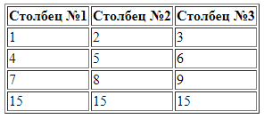

В практической деятельности иногда возникает необходимость объединить строки
или столбцы таблицы для этого используются атрибуты `rowspan` и `colspan` тегов
`th` и `td`. В данных атрибутах задается, какое количество строк или столбцов
необходимо объединить.

Приведем пример использования атрибутов для объединения строк и столбцов. 
Объединим второй и третий столбцы в первой строке таблицы при помощи `colspan`.
Также объединим вторую и третью строки при помощи `rowspan`.

```html
<table border="1">
  <thead>
    <tr>
      <th>Столбец №1</th>
      <th>Столбец №2</th>
      <th>Столбец №3</th>
    </tr>
  </thead>
  <tbody>
    <tr>
      <td>1</td>
      <td colspan="2">2</td>
    </tr>
    <tr>
      <td rowspan="2">4</td>
      <td>5</td>
      <td>6</td>
    </tr>
    <tr>
      <td>8</td>
      <td>9</td>
    </tr>
  </tbody>
  <tfoot>
    <tr>
      <td>15</td>
      <td>15</td>
      <td>15</td>
    </tr>
  </tfoot>
</table>
```

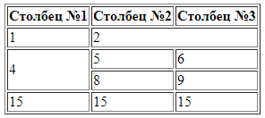

## Тег input

Тег `input` предназначен для ввода данных пользователем. Формат ввода данных
зависит от атрибута `type` тега `input`. Список возможных значений атрибута 
`type` можно найти [здесь](https://www.w3schools.com/html/html_form_input_types.asp).
Отметим, что тег `input` является строчным и самозакрывающимся. Поэтому, чтобы 
разнести примеры с тегами `input` по разным строкам, будем оборачивать данный 
тег в `div`.

Рядом с тегом `input` можно отображать текстовое поле, которое будет пояснять 
пользователю, какие данные вводить или какой элемент выбрать. Текстовое поле
задается тегом `label`. Чтобы связать `label` с `input`, в теге `input` 
необходимо задать атрибут `id` с любым уникальным идентификатором в рамках
страницы, а в теге `label` указать атрибут `for` с тем же идентификатором.

При помощи тега `input` можно создать кнопку. Для этого в атрибуте `type` 
необходимо установить значение `button`. Название кнопки задается в атрибуте
`value`.

```html
<div>
  <label for="button">Пример кнопки:</label>
  <input type="button" id="button" value="Нажми на меня!">
</div>
```

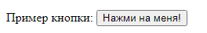

Значение `text` атрибута `type` является значением по умолчанию для данного
атрибута. При этом значении, `input` принимает вид поля ввода.

```html
<div>
  <label for="text">Пример поля ввода:</label>
  <input type="text" id="text">
</div>
```

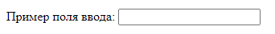

Значение `checkbox` атрибута `type` задает чекбокс.

```html
<div>
  <input type="checkbox" id="checkbox-1">
  <label for="checkbox-1">Яблоко</label>
</div>
<div>
  <input type="checkbox" id="checkbox-2">
  <label for="checkbox-2">Груша</label>
</div>
<div>
  <input type="checkbox" id="checkbox-3">
  <label for="checkbox-3">Гранат</label>
</div>
```


Если указать в атрибуте `type` значение `radio`, то `input` примет вид
радиокнопки.

```html
<div>
  <input type="radio" id="radio-1" name="radioname">
  <label for="radio-1">Яблоко</label>
</div>
<div>
  <input type="radio" id="radio-2" name="radioname">
  <label for="radio-2">Груша</label>
</div>
<div>
  <input type="radio" id="radio-3" name="radioname">
  <label for="radio-3">Гранат</label>
</div>
```


Для создания ползунка с выбором из диапазона значений необходимо установить
`range` в атрибуте `type`. Дополнительными атрибутами `input` для типа `range`
служат `min`, `max`, `step` - минимальное значение, максимальное значение и шаг.

```html
<div>
  <label for="range">Пример ползунка:</label>
  <input type="range" id="range" min="0" max="100" step="5">
</div>
```


Задать время можно при помощи значения `time` в атрибуте `type`. Тип `date` 
позволяет выбрать дату, а `datetime-local` дату и время.

```html
<div>
  <label for="time">Пример задания времени:</label>
  <input type="time" id="time">
</div>
```

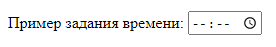

```html
<div>
  <label for="date">Пример задания даты:</label>
  <input type="date" id="date">
</div>
```

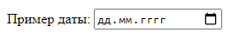

```html
<div>
  <label for="datetime-local">Пример задания даты и времени:</label>
  <input type="datetime-local" id="datetime-local">
</div>
```

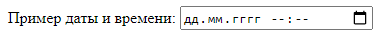

## Гиперссылки

Для задания гиперссылки используется строчный тег `a`. У данного тега 
присутствует обязательный атрибут `href`. В данном атрибуте задается ссылка на 
веб-страницу другого или текущего сайта. Ссылка может быть абсолютной и 
относительной. Относительные ссылки указывают на другие страницы текущего сайта
относительно того документа, где они используются.

```html
<div>
  <a href="https://www.w3schools.com/html/default.asp">Пример абсолютной ссылки 
    на сайт www.w3schools.com</a>
</div>
<div>
  <a href="/index.php">Пример относительной ссылки на другую страницу текущего 
    сайта</a>
</div>
```

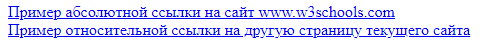


# Что такое CSS?

CSS (Cascading Style Sheets "каскадные таблицы стилей") - это язык, 
предназначенный для оформления внешнего вида веб-страницы, которая написана на
языке разметки. CSS позволяет задавать цвета, границы, шрифты и многое другое 
для элементов веб-страницы.

Стили для веб-страницы, как правило, помещаются в отдельный файл с расширением
`.css`.

Создадим файл `style.css` со стилями для страницы `index.html` в каталоге 
`application`.

Чтобы подключить файл со стилями к html-документу используется тег `link`. 
Подключение css-файлов происходит в теге `head` html-документа.

```html
<link rel="stylesheet" href="style.css">
```

В теге `link` необходимо указать два атрибута `rel` и `href`. Атрибут `rel` 
сообщает браузеру о том, документ какого типа будет подключен к html-странице.
Для css-файла в `rel` указывается значение `stylesheet`. В атрибуте `href` 
указывается путь до файла со стилями относительно документа, в котором этот 
файл подключается.

Для задания стилей `css` используется следующий синтаксис:

```css
селектор {
  свойство: значение;
  свойство: значение;
  свойство: значение;
}
```

`Селектор` - это некоторое выражение, которое позволяет браузеру определить, к
какому/каким HTML-элементам необходимо применить стили.

Также как и с атрибутами, HTML-элементы имеют свои специфичные свойства CSS.

Чтобы посмотреть стили HTML-элементов в браузере Chrome, необходимо нажать 
клавишу `F12`, перейти во вкладку `Элементы` и выбрать конкретный HTML-элемент.

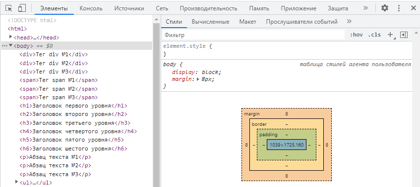

Для дальнейшего понимания некоторых свойств CSS, рассмотрим блочную модель 
HTML-элемента.

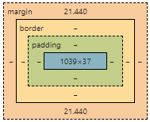

Содержимое HTML-тега называется `контентом` и на рисунке выше представлено синей
областью. Вокруг контента может присутствовать `внутренний отступ (padding)`.
`Рамка (border)` ограничивает контент и внутренние отступы. `Внешний отступ (margin)`
содержит в себе контент, внутренний отступ и рамку. Внешний отступ предназначен
для отделения одного элемента от другого.

Блочные элементы полностью поддерживают блочную модель, строчные элементы 
используют не все свойства блочной модели.

## Виды CSS-селекторов

Рассмотрим основные CSS-селекторы, которые применяются на практике.

Чтобы задать стили для всех элементов страницы используется css-селектор `*`.

```css
* {
  свойство: значение;
  свойство: значение;
  свойство: значение;
}
```

Браузеры задают для некоторых HTML-элементов свойства по умолчанию. Иногда, 
данные свойства не нужны на конкретном сайте, поэтому их переопределяют для всех
тегов при помощи `*`.

Следующим селектором является селектор тегов. Данный селектор задает стили
для всех HTML-элементов одного типа. Например, селектор для абзацев:

```css
p {
  свойство: значение;
  свойство: значение;
  свойство: значение;
}
```

Если у HTML-элемента имеется атрибут `id`, то на основании данного идентификатора
можно изменить стиль элемента при помощи селектора идентификаторов. Пусть, 
например, у тега `p` имеется атрибут `id` со значением `firstId`. Тогда для 
задания стилей используется селектор состоящий из знака `#` и значения в атрибуте
`id`.

```css
#firstId {
  свойство: значение;
  свойство: значение;
  свойство: значение;
}
```

Если при помощи атрибута `id` можно задать стили только для одного элемента, то
возникает вопрос, что делать при наличии нескольких одинаковых кнопок или ссылок
на странице? Как задать одинаковые стили для данных элементов? Это можно сделать,
если у каждой кнопки указать атрибут `class` с одинаковым значением. Затем в 
CSS воспользоваться селектором классов. Приведем пример:

```html
<input type="button" class="btn" value="Раз">
<input type="button" class="btn" value="Два">
<input type="button" class="btn" value="Три">
```

Для задания стилей для класса элементов в CSS используется селектор состоящий
из `.` и названия класса.

```css
.btn {
  свойство: значение;
  свойство: значение;
  свойство: значение;
}
```

Если необходимо задать стили для всех потомков какого-либо элемента, то 
используется селектор потомков. Допустим, есть следующая верстка:

```html
<div>
  <input type="button" value="Раз">
  <span>
    <input type="button" value="Два">
  </span>
</div>
```

Чтобы задать одинаковые стили для всех `input`-ов внутри тега `div`, используем
селектор потомков:

```css
div input {
  свойство: значение;
  свойство: значение;
  свойство: значение;
}
```

Селектор потомков задает стили для всех вложенных в элемент потомков. Если 
необходимо задать стили только для дочерних элементов (потомков первого уровня),
то используется селектор дочерних элементов:

```css
div > input {
  свойство: значение;
  свойство: значение;
  свойство: значение;
}
```
