# Оглавление

1. [Система контроля версий Git](#система-контроля-версий-git)

2. [Создание репозитория](#создание-репозитория)
    
3. [Настройка репозитория](#настройка-репозитория)

4. [Текущий статус рабочей директории](#текущий-статус-рабочей-директории)

5. [Добавление файлов в индекс](#добавление-файлов-в-индекс)

6. [Фиксация изменений](#фискация-изменений)

7. [История изменений](#история-изменений)

8. [Игнорирование файлов и каталогов. Файл .gitignore](#игнорирование-файлов-и-каталогов-файл-gitignore)

9. [Переключение версий проекта](#переключение-версий-проекта)

10. [Создание новых веток проекта. Переключение на ветки](#создание-новых-веток-проекта-переключение-на-ветки)

11. [Слияние доработок](#слияние-доработок)

12. [Ошибки при слиянии веток](#ошибки-при-слиянии-веток)

13. [Создание удаленного репозитория на GitHub](#создание-удаленного-репозитория-на-github)

14. [Отправка данных в удаленный репозиторий](#отправка-данных-в-удаленный-репозиторий)

15. [Получение данных из удаленного репозитория](#отправка-данных-в-удаленный-репозиторий)

16. [Клонирование удаленного репозитория](#клонирование-удаленного-репозитория)

17. [Git Credential Manager](#git-credential-manager)


# Система контроля версий Git

Система контроля версий (СКВ) - это система, записывающая изменения в файл или набор 
файлов в течение времени и позволяющая вернуться позже к определённой версии. В
нашем курсе мы будем знакомиться с одной из самых распространенных систем 
контроля версий Git.

Git - является распределенной системой контроля версий. В таких системах 
версионируемые проекты, кроме хранения на сервере, также хранятся и на локальных
машинах участников проекта. Данный подход позволяет снизить риски потери данных
проекта, в случае отказа центрального сервера.

Одним из основных понятий в Git является репозиторий. `Репозиторий` - это каталог
файловой системы, в котором хранятся версионируемые данные и служебные файлы
СКВ Git. Репозитории бывают локальные и удалённые. Удалённые репозитории 
хранятся, как правило, на серверах, а локальные - на локальных машинах.

Следующим понятием является коммит. `Коммит` - это зафиксированное в 
определенный момент времени состояние репозитория, которое имеет уникальный 
идентификатор. По истории коммитов можно произвести откат доработок к тому или 
иному состоянию репозитория.

`Ветка` - это параллельная версия репозитория. Благодаря созданию новой ветки,
можно дорабатывать функционал, не затрагивая базовый функционал. Затем, когда
все протестировано, произвести объединение функционала ветки с базовым 
функционалом.

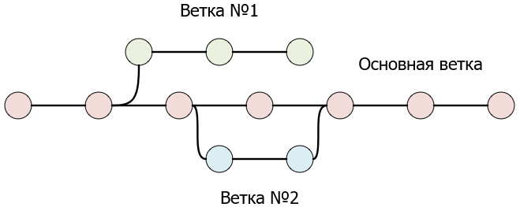

Перейдем к рассмотрению принципа работы Git. У Git есть три основных состояния,
в которых могут находиться файлы проекта. Файл может быть изменен (modified),
индексирован (staged) и зафиксирован (committed).

Условно репозиторий Git можно поделить на три секции: рабочая копия
репозитория, индекс или зона подготовки к коммиту и локальный репозиторий.

Локальный репозиторий - это место, где Git хранит различные версии проекта.

Рабочая копия - это копия некоторой версии проекта из локального репозитория,
которая доступна для редактирования. При редактировании файлов рабочей копии,
их статус переходит в состояние `изменен`.

Индекс - это файл, в котором хранится информация о том, какие доработки в файлах
попадут в следующий коммит. 

Напрашивается вопрос, для чего необходим индекс, если можно напрямую фиксировать
изменения из рабочей копии? Дело в том, что в процессе работы может быть 
исправлено несколько файлов рабочей копии. Причем, в некоторых файлах доработки
завершены, а в некоторых нет. Возникает желание сохранить сделанные доработки.
Но при фиксации изменений без индекса будут зафиксированы и недоработанные 
файлы. Введение индекса позволяет решить данную проблему. Логически завершенные
доработки помещаем в индекс, а затем производим фиксацию доработок из индекса.
При этом недоработанные файлы в коммит уже не попадут.

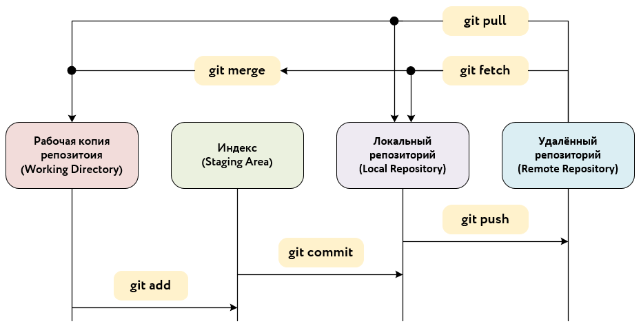

Перейдем к рассмотрению команд для работы с Git. Для этого откроем каталог 
`C:\web\application` и на свободном месте нажмем ПКМ. Появится контекстное меню,
в котором необходимо выбрать `Git bash here`.

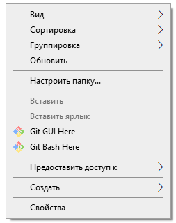

В результате, должен открыться терминал `bash`.

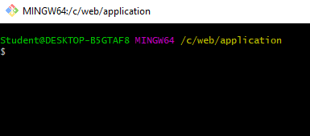

Все последующие команды будут выполняться в данном терминале.

## Создание репозитория

Для объявления конкретного каталога файловой системы репозиторием Git, 
необходимо в терминале перейти в данный каталог и использовать команду:

```
git init
```

В нашем случае, необходимо выполнить данную команду в каталоге `application`.

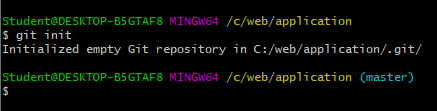

При этом в каталоге `application` появился скрытый каталог `.git`. В данном 
каталоге хранятся версии файлов, соответственно, он является локальным 
репозиторием Git.

Каталог `application` без учета каталога `.git` с версионируемыми файлами будет
являться рабочей директорией Git.

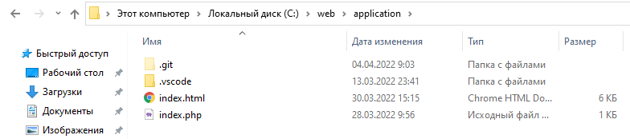

Файл индекса Git будет расположен в каталоге `.git`. На текущий момент, так как
никакие файлы не добавлены в индекс, файл индекса отсутствует. Кроме этого, в 
данном каталоге находится основной конфигурационный файл `config` локального 
репозитория.

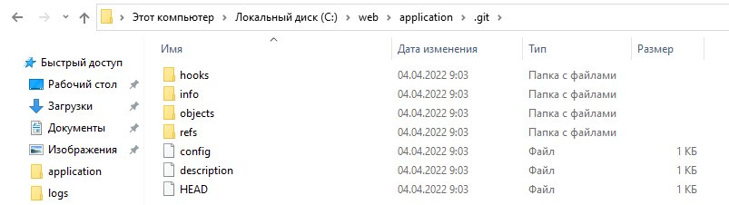

## Настройка репозитория

Для дальнейшей корректной работы репозитория, необходимо настроить имя 
пользователя и e-mail пользователя. Это можно сделать при помощи команд:

```
git config --local user.name "Фамилия Имя"
git config --local user.email "test@gmail.com"
```

`--local` - означает, что настройки производятся только для текущего репозитория.

## Текущий статус рабочей директории

Чтобы понять в каком состоянии находится рабочая директория, в Git имеется 
команда для определения статуса:

```
git status
```

Определим текущий статус рабочей директории `application`.

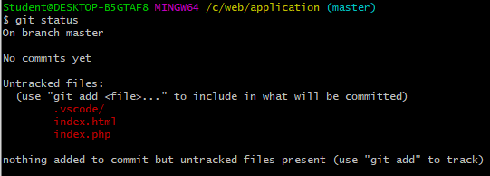

Из рисунка видим, что на текущий момент отображаются два неотслеживаемых файла
(`untracked files`) и один неотслеживаемый каталог `.vscode/`.

## Добавление файлов в индекс

Для добавления файлов в индекс используется команда:

`git add ОТНОСИТЕЛЬНЫЙ_ПУТЬ_ДО_ФАЙЛА`

Под относительным путем до файла, понимается путь относительно корня репозитория
(где располагается каталог `.git`, там и находится корень репозитория).

Добавим файлы `index.html` и `index.php` в индекс. Не забываем про расширения
файлов. Их тоже необходимо указывать в пути до файла.

```
git add index.html
git add index.php
```

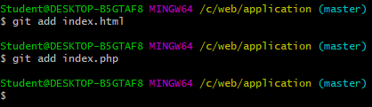

Посмотрим текущий статус репозитория при помощи команды `git status`:

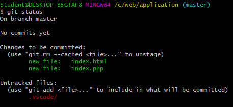

В разделе `changes to be committed` отображаются файлы, которые находятся в 
индексе на текущий момент. Каталог `.vscode` остался в разделе неотслеживаемых
файлов.

Иногда требуемся добавить в индекс все файлы. Чтобы не перечислять имена файлов,
можно использовать сокращенную команду:

```
git add .
```

Также можно добавлять несколько файлов в индекс за один раз. Для этого после
команды `git add` указываются относительные пути до файлов через пробел. 
Например:

```
git add index.html index.php
```

## Фиксация изменений

В предыдущем пункте в индекс были добавлены два файла. Зафиксируем изменения в
файлах при помощи команды:

```
git commit
```

После нажатия на `enter` должно открыться окно `Notepad++`, в котором необходимо
ввести комментарий к коммиту. Комментарий должен описывать, почему были сделаны
те или иные изменения, какие баги были исправлены и т.д. В нашем случае, мы
просто напишем, что это начальный коммит.

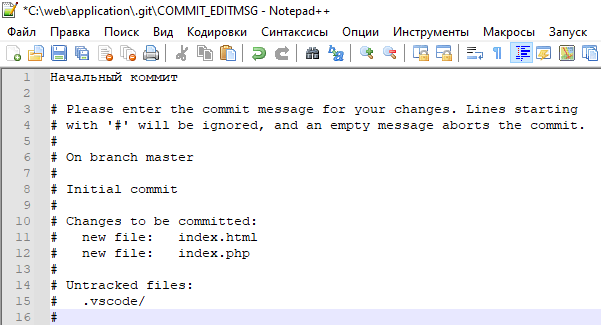

Далее закроем `Notepad++`. При закрытии возникнет сообщение, в котором 
необходимо нажать на `Да`.

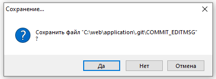

После закрытия файла, в `bash` отобразится информация о коммите:

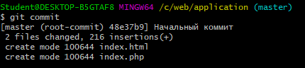

Посмотрим статус рабочей директории после коммита:

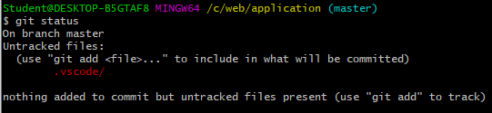

Каталог `.vscode` остался в категории неотслеживаемых файлов. Категория с 
файлами в индексе пропала.

## История изменений

Историю с изменениями можно посмотреть при помощи команды:

```
git log
```

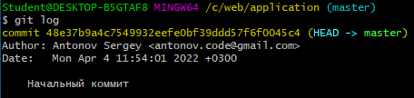

На текущий момент в истории отображается один коммит. Также для коммита
указывается следующая информация: автор, дата, комментарий, номер коммита. Номер
коммита указывается после слова `commit`. Если коммитов будет много, то все
они не поместятся на один экран. Чтобы посмотреть более ранние коммиты, можно,
например, нажимать `enter`. Для выхода из режима просмотра коммитов нужно нажать
`q`.

## Игнорирование файлов и каталогов. Файл .gitignore

На текущий момент в репозитории находится неотслеживаемый каталог `.vscode`.
Данный каталог является служебным каталогом `Visual Studio Code`. Включать его
в проект не имеет смысла, так как другой разработчик может использовать вместо
`Visual Studio Code` другую программу для разработки и просмотра кода.


Чтобы неотслеживаемый каталог не отображался в выводе `git status`, существует
возможность добавить данный каталог в список игнорируемых каталогов и файлов.

Для этого создадим в каталоге `application` файл с именем `.gitignore`.

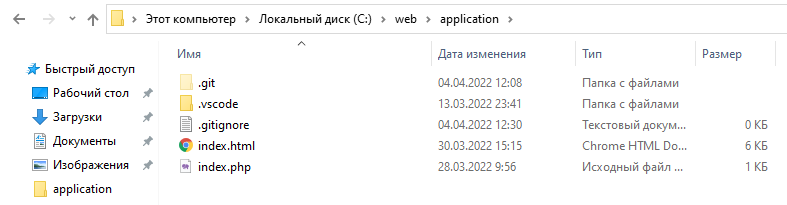

Откроем файл `.gitignore` в `Notepad++` и добавим строчку `.vscode/`. Сохраним и
закроем `Notepad++`.

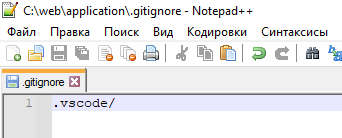

Проверим статус репозитория.

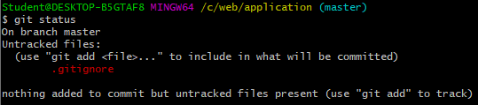

В списке неотслеживаемых файлов появился файл `.gitignore`, но при этом пропал
каталог `.vscode`. Данный каталог теперь в списке игнорируемых командой 
`git status`.

В `.gitignore` следует указывать пути относительно корня репозитория для 
служебных файлов и каталогов, не относящихся к проекту. Каждый файл или каталог
указывается с новой строки.

Добавим файл `.gitignore` в индекс и сделаем `commit`.

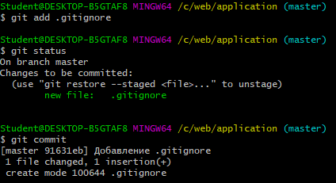

Теперь в истории изменений два коммита:

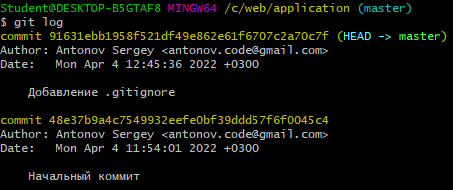

## Переключение версий проекта

Добавим перед закрывающим тегом `body` в файле `index.html` новый абзац с текстом и сохраним файл.

```html
<p>Система контроля версий Git</p>
```

Зафиксируем данные изменения. Теперь в истории изменений три коммита.

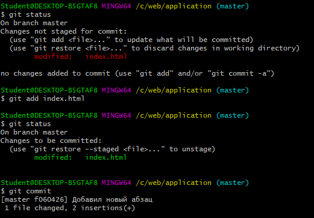

Предположим, что нам необходимо вернуться к предыдущей версии проекта, так как 
текущие доработки интерфейса пока еще не были протестированы.

Для этого сначала определим номер коммита предыдущей версии проекта при помощи
`git log`.

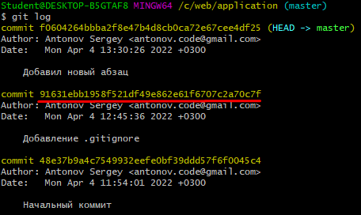

Зная номер необходимого коммита, мы можем переключиться на требуемую версию
проекта при помощи команды:

```
git checkout НОМЕР_КОММИТА
```

Необязательно полностью указывать весь номер коммита для переключения на другую версию проекта. Минимум нужно указать первые четыре символа. Лучше указывать 6-8 первых символов.

Переключимся на второй коммит.

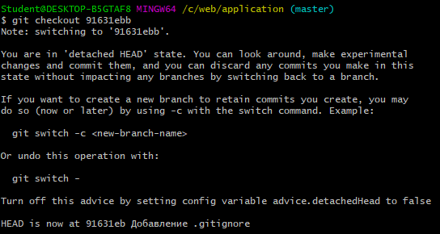

Теперь, если мы откроем файл `index.html`, то увидим, что те доработки, которые
мы делали, пропали.

## Создание новых веток проекта. Переключение на ветки

В предыдущем пункте мы выполняли переключение между коммитами и возвращались к 
предыдущей версии проекта. Предположим, необходимо доработать текущий функционал
сайта. Если пользователя не понравится новая версия сайта, необходимо иметь 
возможность вернуться на старую.

Данную задачу можно решить при помощи создания новой ветки проекта. Как уже 
говорилось ранее, ветка - эта параллельная версия репозитория. До этого
мы делали коммиты в основной ветке проекта `master`. Название данной ветки
отображалось в `bash` рядом с путем до каталога `application`.

Сейчас мы находимся на втором коммите проекта. От данного коммита ветки `master`
создадим новую параллельную ветку `feature`. Для создания новой ветки используется команда:

```
git branch ИМЯ_ВЕТКИ
```

Для `feature` команда примет вид:

```
git branch feature
```

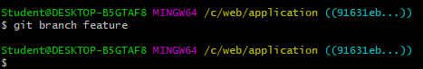

Посмотреть список всех локальных веток можно, добавив опцию `--list` к команде
`git branch`.

```
git branch --list
```

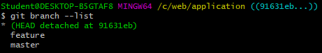

Как видим из рисунка, в репозитории теперь имеется две ветки `feature` и
`master`.

После создания новой ветки, необходимо переключиться на нее командой при помощи
`git checkout`.

```
git checkout feature
```

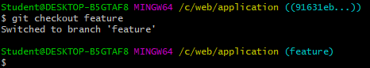

Так как ветку `feature` мы создали от второго коммита, то доработок из третьего
коммита в `index.html` нет.

Вставим после открывающего тэга `body` новую кнопку в файле `index.html` и 
сделаем коммит.

```html
<input type="button" value="Привет!">
```

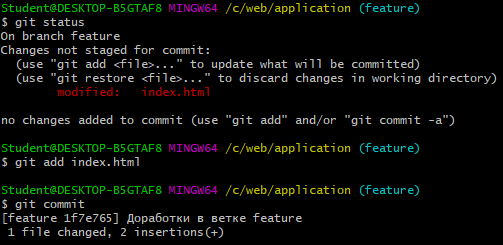

## Слияние доработок

Рассмотрим ситуацию, когда доработки из ветки `feature` понравились 
пользователям и мы должны обновить основную версию сайта. Для этого можно было
бы вручную скопировать данные доработки в ветку `master` и сделать коммит. Но 
этот процесс можно поручить Git. Git самостоятельно выполнит слияние кода веток
`master` и `feature`.

Чтобы правильно выполнить слияние кода, необходимо, для начала, переключиться на
ветку, в которую мы хотим включить новые доработки. В нашем случае, такой веткой
является ветка `master`. Затем выполняем команду слияния веток:

```
git merge ИМЯ_ВЕТКИ_С_НОВЫМИ_ДОРАБОТКАМИ
```

В нашем случае, мы выполняем включение доработок ветки `feature` в ветку 
`master`.

```
git merge feature
```

При слиянии откроется текстовый файл в `Notepad++`. В файле будет содержаться 
сообщение для коммита слияния. Данное сообщение можно не править и закрыть файл.

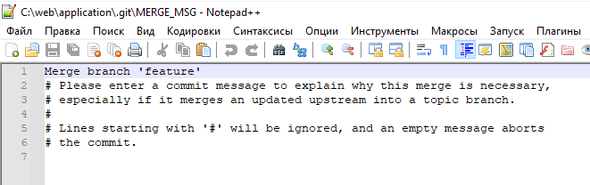

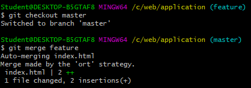

В результате слияния веток, в истории изменений теперь пять коммитов. Последний 
коммит в истории изменений является коммитом слияния двух веток.

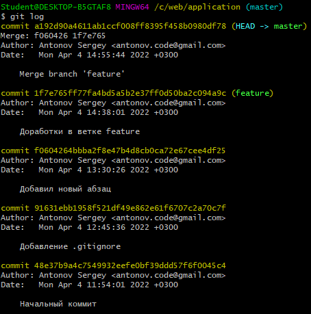

## Ошибки при слиянии веток

В процессе слияния веток могут произойти ошибки, из-за которых слияние не может 
быть завершено. Такое случается, например, когда в разных ветках исправляется
один и тоже участок кода. В таком случае Git предлагает разработчику 
самостоятельно разрешить конфликты слияния и произвести коммит.

Попробуем смоделировать такую ситуацию. Для этого найдем в файле `index.html` 
ветки `master` код доработок из третьего коммита.

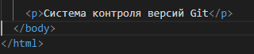

Изменим абзац на следующий и сделаем коммит:

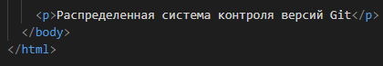

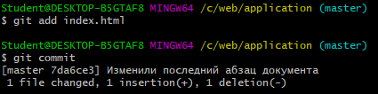

В истории изменений появится еще один коммит.

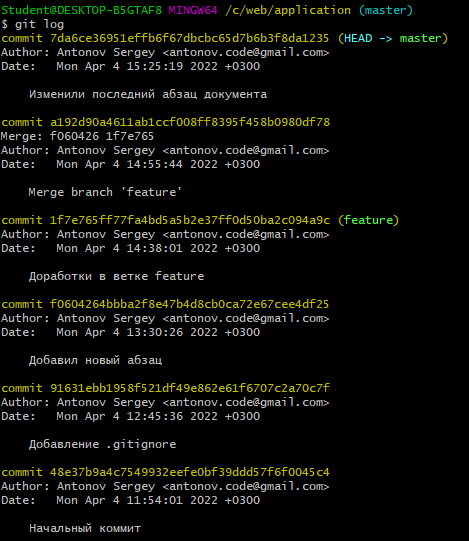

Переключимся на коммит слияния с номером `a192d90` и создадим новую ветку
`feature-2`.

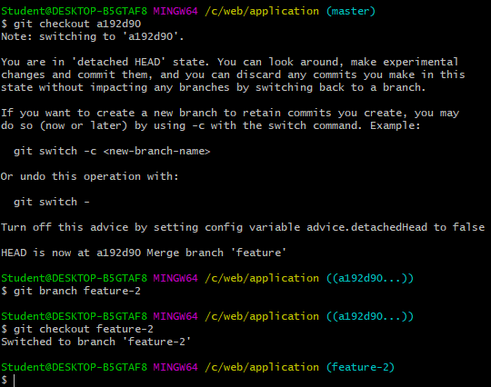

В новой ветке изменим тот же участок кода в файле `index.html` и сделаем коммит.

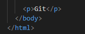

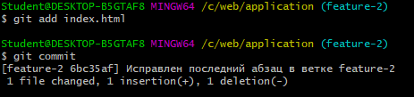

Переключимся на ветку мастер и попробуем сделать слияние с веткой `feature-2`.

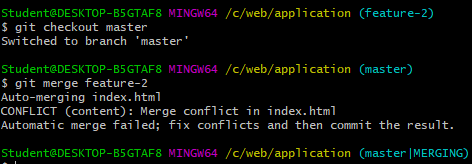

При слиянии возник конфликт в файле `index.html`, а ветка мастер перешла в 
состояние слияния. Попробуем исправить конфликт. Для этого откроем файл 
`index.html`.

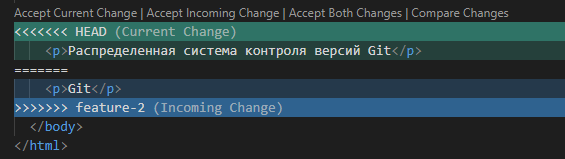

Предположим, что мы хотим оставить доработки из обеих веток. Тогда достаточно
удалить лишние строки, которые добавил Git.

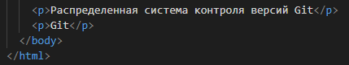

Дальше необходимо сделать коммит доработок. При коммите откроется `Notepad++`,
в котором можно не изменять сообщение коммита слияния.

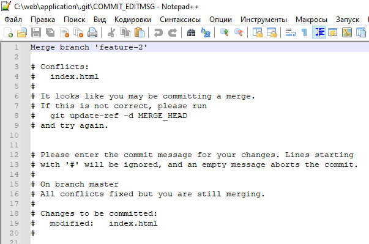

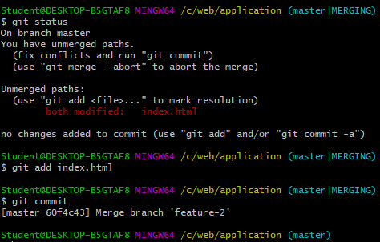

## Создание удаленного репозитория на GitHub

Попробуем разместить наш созданный репозиторий на GitHub. GitHub - это 
веб-сервис, предоставляющий пользователям возможность создавать удаленные 
репозитории Git для своих проектов и вести совместную разработку.

Для начала необходимо произвести регистрацию на [GitHub](https://github.com/).
После регистрации перейдем к созданию репозитория. Для этого нажмем кнопку
`New repository`.

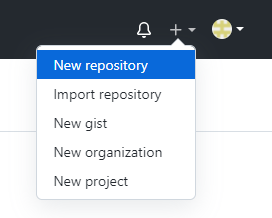

Откроется страница с настройками для нового репозитория. На данной странице
необходимо задать имя репозитория и сделать репозиторий приватным. После чего
нажать на кнопку `Create repository`.

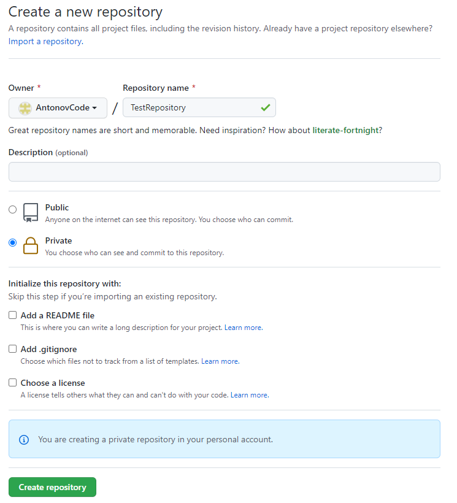

Далее откроется окно созданного репозитория с подсказками для настройки
локального репозитория.

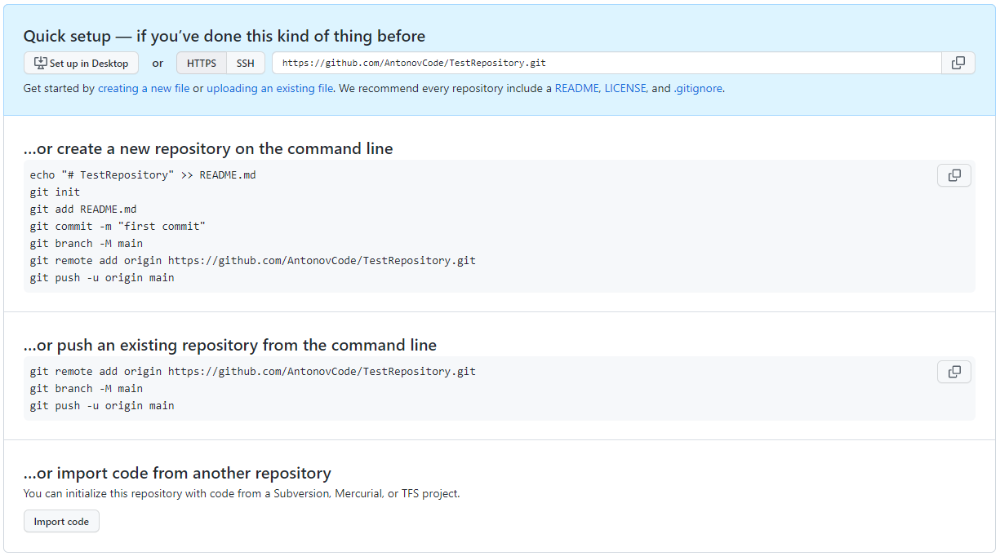

Далее необходимо сгенерировать токен доступа, который будет необходим при 
отправке локальных доработок в удаленный репозиторий. Для этого перейдем в 
настройки аккаунта.

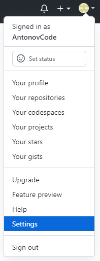

После открытия окна с настройками аккаунта, перейдем в раздел `Developer settings`.

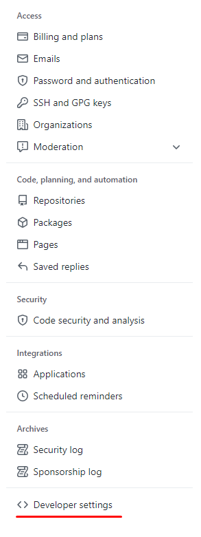

Далее перейдем в раздел `Personal access token` и нажмем на кнопку `Generate new token`.
Появится окно, в котором нужно ввести пароль от аккаунта.

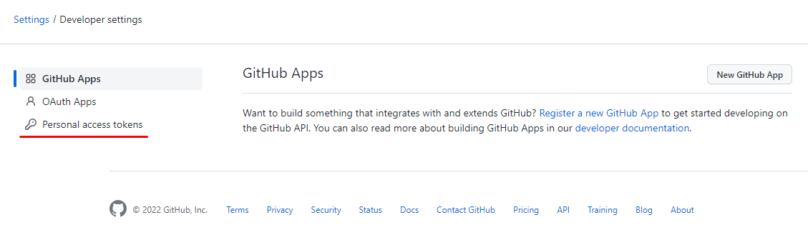

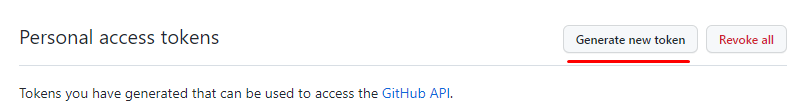

В окне настройки токена необходимо ввести в поле `Note`, для чего необходим 
токен. В поле срока действия токена `Expiration` выбрать `No expiration`. В
разделе `Select scopes` выбираем галочку `repo`. После чего внизу страницы
нажимаем на кнопку `Generate token`.

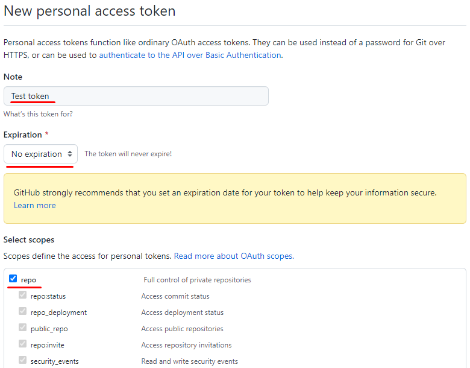

Далее откроется страница с новым токеном, который необходимо куда-нибудь 
сохранить, так как больше данный токен видно не будет.


После генерации нового токена доступа необходимо связать локальный и удаленный
репозиторий. Для этого перейдем в удаленный репозиторий и скопируем следующую
команду:


Команда `git remote add origin ССЫЛКА_НА_РЕПОЗИТОРИЙ` настраивает отправку 
данных из локального репозитория в удаленный. `origin` - это имя удаленного
репозитория по умолчанию. Можно задать любое, но лучше оставить значение по 
умолчанию.

Вставим скопированную команду в `bash`. При этом в локальном репозитории 
необходимо находиться на ветке `master`.


Далее необходимо выполнить команду для первой отправки данных в удаленный 
репозиторий. При этом локальная ветка `master` будет соответствовать удаленной
ветке `master`.

```
git push -u origin master
```

После ввода данной команды, появится окно, в котором необходимо указать логин 
GitHub. Нажимаем `OK`.


Затем появится окно с вводом пароля, в которое необходимо вставить 
сгенерированный токен и нажать `OK`.


Доработки отправятся на сервер, а в консоли отобразится информация об отправке
данных.


Перейдем в наш репозиторий на GitHub и увидим доработки.


## Отправка данных в удаленный репозиторий

Добавим в конец файла `index.html` перед закрывающим тэгом `body` новую кнопку
и сделаем коммит:

```html
<input type="button" value="Привет!">
```


На текущий момент новый коммит находится в локальном репозитории. Чтобы 
отправить данный коммит в удаленный репозиторий, необходимо использовать 
команду:

```
git push
```

Появится окно ввода логина, куда вводим логин на GitHub, а затем окно ввода 
пароля, в которое вводим сгенерированный токен доступа.


После отправки данных на GitHub появится новый коммит6


## Получение данных из удаленного репозитория

Если в проекте участвуют несколько разработчиков, то периодически необходимо
обновлять локальный репозиторий, чтобы получить доработки других людей. Это 
делается при помощи следующей команды:

```
git pull
```


В нашем случае, удаленный репозиторий соответствует локальному, поэтому никаких
доработок не было скачано с удаленного репозитория.

## Клонирование удаленного репозитория

Иногда возникают ситуации, когда необходимо скопировать удаленный репозиторий
себе на локальную машину. Например, скопировать какие-либо библиотеки. Для этого
существует специальная команда клонирования `git clone`. Перед клонированием
репозитория, сначала необходимо скопировать ссылку на удаленный репозиторий.

Скопируем себе на локальную машину репозиторий нашего [курса по разработке](https://github.com/croc-chelyabinsk/susu-course). Для этого нажмем на кнопку `Code` и скопируем
ссылку https://github.com/croc-chelyabinsk/susu-course.git.

На рабочем столе нажмем ПКМ и откроем новый терминал `bash`. Далее выполним 
команду клонирования:

```
git clone https://github.com/croc-chelyabinsk/susu-course.git
```


## Git Credential Manager

При взаимодействии с удаленным репозиторием по HTTPS, необходимо постоянно 
вводить логин и пароль. Чтобы упростить данное взаимодействие, можно поручить 
вопросы авторизации диспетчеру учетных данных от Microsoft, но для этого нужно
скачать и установить [Git Credential Manager](https://github.com/GitCredentialManager/git-credential-manager/releases/tag/v2.0.632) (примерное название файла  
gcmcore-win-x86-2.0.632.34631.exe).

При первом `push` или `pull` после установки Git Credential Manager, необходимо
ввести токен доступа. В случае изменения токена доступа на Github, также 
придется поменять токен доступа и в диспетчере учетных данных Windows.

