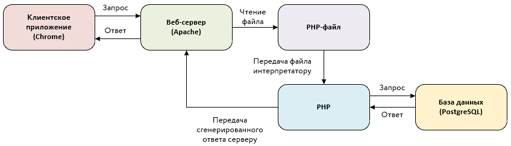

# Оглавление

1. [Что такое PHP?](#что-такое-php)

2. [Типы данных PHP](#типы-данных-php)

2. [Базовый синтаксис PHP](#базовый-синтаксис-php)

3. [Взаимодействие с базой данных. Класс PDO](#взаимодействие-с-базой-данных-класс-pdo)

# Что такое PHP?

PHP (рекурсивный акроним словосочетания PHP: Hypertext Preprocessor) - это 
скриптовый язык общего назначения с динамической типизацией, который 
предназначен для создания веб-приложений.

Код языка PHP может встраиваться в HTML-верстку. При помощи такой возможности
можно генерировать HTML-страницы с динамическим содержимым.

Для создания динамической HTML-страницы на языке PHP, верстку и PHP-код 
необходимо помещать в файлы с раcширением `.php`.

На рисунке ниже представлена схема работы веб-приложения, использующего, в 
качестве серверного языка, язык PHP.



Код PHP должен заключаться в специальный тег, который выглядит следующим образом:

```php
<?php
// Код на PHP
?>
```

`<?php` - это открывающий тег, а `?>` - закрывающий.

Одной из особенностей языка PHP является то, что все переменные в данном языке
должны начинаться со знака `$`.

# Типы данных PHP

Рассмотрим основные типы данных, которые присутствуют в языке PHP. Начнем с 
целых чисел. Для создания переменной с целочисленным значением достаточно 
указать необходимо число после оператора присваивания:

```php
$a = 5;
```

Числа с плавающей точкой (`float` или `double`) задаются следующим образом:

```php
$b = 21.5;
$c = 5.1e4; // 5.1 * 10^4
```

Переменные логического типа принимают значения `true` или `false`:

```php
$d = true;
$e = false;
```

Строки в PHP можно задать несколькими способами. Самый простой способ 
использовать одинарные кавычки:

```php
$string_1 = 'Простая строка';
```

Также задать строку можно при помощи двойных кавычек. В таком случае, PHP 
сможет распознать строке управляющие последовательности и производить обработку
переменных. При использовании одинарных кавычек такого не происходит.
При вставке переменных в строку рекомендуется использовать фигурные скобки, хотя
достаточно прописывать название переменной в строке.

```php
$string_2 = "Простая строка";

$year = 2022;
$string_3 = "Текущий год: ${year}"; // Текущий год: 2022
```

В качестве оператора конкатенации (объединения строк), в PHP используется 
оператор `.` . Рассмотрим пример:

```php
$string_one = "one";
$string_two = "two";
$string_result_one = $string_one . $string_two; // onetwo
$string_result_two = "first" . "second"; // firstsecond
```

Как и в SQL, в PHP существует специальное значение `null`, которое указывает, 
что переменная не имеет значения.

```php
$empty = null;
```

Следующим типом данных в PHP являются массивы. Массивы делятся на две группы:
ассоциативные и индексированные. Рассмотрим ассоциативные массивы.

Ассоциативные массивы - это набор данных в формате `ключ` => `значение`. В таком
массиве при необходимости можно получить данные на основании ключа. Ключ может
быть в формате `int` или `string`, а значение может быть любым типом данных.

Для создания массива можно использовать полный или сокращенный синтаксис:

```php
// Полный синтаксис
$array_1 = array(
    "one"   => 1,
    "two"   => 2,
    "three" => 3
);

// Сокращенный синтаксис
$array_2 = [
    "one"   => 1,
    "two"   => 2,
    "three" => 3
];

// Получение значения по ключу:
$value_1 = $array_1["two"]; // 2
```

Индексированный массив - это упорядоченный набор данных, в котором каждому 
значению массива задается порядковый номер (индекс). По умолчанию индекс 
начинается с нуля.

```php
// Полный синтаксис
$array_3 = array("яблоко", "груша", "гранат");

// Сокращенный синтаксис
$array_4 = ["яблоко", "груша", "гранат"];

// Получение значения по ключу:
$value_2 = $array_3[2]; // гранат
```
Для работы с масивами существует [ряд функций](https://www.php.net/manual/ru/ref.array.php).

PHP поддерживает объектно-ориентированную парадигму программирования, поэтому в
языке присутствуют такие конструкции, как классы и объекты. Более подробно с 
ООП в PHP можно ознакомиться по [ссылке](https://www.php.net/manual/ru/language.oop5.php).

Еще одним типом данных в PHP является ресурс. Resource - это специальная 
переменная, содержащая ссылку (указатель) на какой-либо внешний объект (файл,
соединение с базой данных, изображение и т.д.). Как правило, ресурсы создаются
и используются специальными [функциями](https://www.php.net/manual/ru/resource.php).

# Базовый синтаксис PHP

Рассмотрим основные конструкции в языке PHP: условия, циклы, функции, классы,
исключения.

Как и в других языках программирования, в PHP для условных конструкций 
используются ключевые слова: `if` и `else`.

```php
$fruit = "apple";

if ($fruit === "mango") {
    echo "It's mango";
} else {
    echo "What is it?";
}
```

Синтаксисы циклов `for`, `while` и `do while` совпадают с синтаксисом языка `C`:

```php
for($i = 0; $i < 10; $i++) {
    echo "<p>${i}</p>";
}

echo "<br>";

$var = 0;
while($var < 5) {
    echo "<p>${var}</p>";
    $var++;
}

echo "<br>";

$var2 = 2;
do {
    echo "<p>${var2}</p>";
    $var++;
} while ($var2 > 5);
```

Для упрощенного перебора массивов в PHP существует цикл `foreach`:

```php
$colors = ["green", "black", "white", "yellow"];

foreach($colors as $value) {
    echo "<p>${value}</p>";
}
```

Для создания функции в PHP используется ключевое слово `function`.

```php
function sumNumbers($num1, $num2) {
    return $num1 + $num2;
}

echo sumNumbers(5, 4);
```

Чтобы создать класс необходимо использовать ключевое слово `class`. Создадим
класс, который описывает точку.

```php
class Point {
    private $x;
    private $y;

    function __construct($x, $y) {
        $this->x = $x;
        $this->y = $y;
    }

    public function getX() {
        return $this->x;
    }

    public function getY() {
        return $this->y;
    }
}

$point = new Point(1, 2);
echo $point->getX();
```

# Взаимодействие с базой данных. Класс PDO

Для взаимодействия с различными базами данных в PHP, раньше присутствовало 
несколько библиотек с набором похожих функций. Впоследствии, от данного подхода
перешли к объектно-ориентированному подходу. Теперь при взаимодействии с 
большинством баз данных используются одни и те же классы, что достаточно удобно.

Для создания соединения с базой данных используется класс [PDO](https://www.php.net/manual/ru/class.pdo.php).

При создании объекта класса PDO, необходимо передать в конструктор класса три
основных параметра `$dsn`, `$username` и `$password`. `$dsn` (data source name) -
это строка подключения к базе данных. Синтаксис строки подключения можно найти 
[здесь](https://www.php.net/manual/ru/ref.pdo-pgsql.connection.php). Пример
строки `dsn`: `pgsql:host=localhost;port=5432;dbname=test`.

Подключимся к нашей базе данных `test` и попробуем запросить данные из таблицы
студентов:

```php
$dsn = "pgsql:host=localhost;port=5432;dbname=test";
$username = "postgres";
$password = "admin";

$db = new PDO($dsn, $username, $password);
$sql = 'select surname, firstname, lastname from students';

$stmt = $db->query($sql);

while ($row = $stmt->fetch())
{
    echo $row['surname'];
}
```
