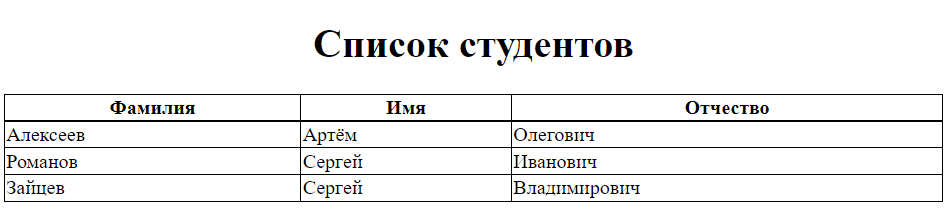
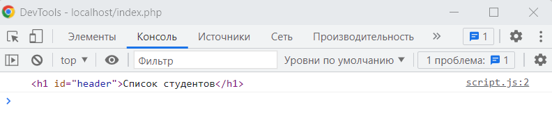
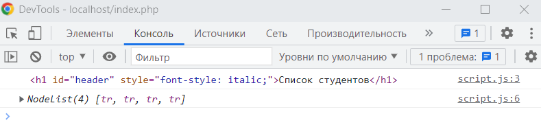
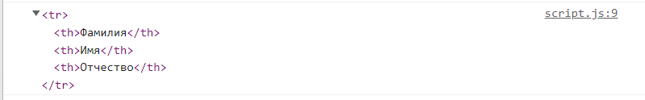
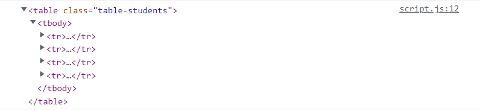

# Оглавление

1. [Что такое JavaScript?](#что-такое-javascript)

2. [Типы данных в JavaScript](#типы-данных-в-javascript)

3. [Работа с DOM](#работа-с-dom)

    3.1 [Получение элементов HTML-страницы](#получение-элементов-html-страницы)
    
    3.2 [Создание и удаление элементов HTML-страницы](#создание-и-удаление-элементов-html-страницы)

# Что такое JavaScript?

JavaScript - это динамически типизированный, мультипарадигменный язык 
программирования, который изначально был предназначен для работы в браузере и 
встраивания в HTML-страницы.

На текущий момент JavaScript вышел за границы браузера и стал применяться в
различных задачах. Например, JavaScript может использоваться сервере, во 
встраиваемых системах и т.д. Тем не менее, JavaScript стал основным языком,
поддерживаемым разными браузерами. В этом курсе мы будем рассматривать 
использование языка JavaScript на стороне браузера.

JavaScript изначально был предназначен для придания веб-страницам интерактивности.
Например, при нажатии кнопки "Лайк" на странице, мы можем увидеть, как 
увеличивается счетчик лайков на странице. Это делается при помощи JavaScript.

JavaScript в браузере можно разделить на три части:

* ядро языка;
* объектная модель браузера (Browser Object Model или BOM);
* объектная модель документа ((Document Object Model или DOM).

В ядре языка реализована поддержка основных типов данных, конструкций языка,
операторов и т.д.

Объектная модель браузера описывает взаимодействие с окнами браузера, вкладками,
системными диалогами т.д. Ключевым глобальным объектом для управления окном 
браузера служит объект `window`.

Объектная модель документа описывает интерфейс взаимодействия с элементами 
HTML-страницы. Например, как получить определенный элемент страницы, задать
атрибуты элементу, удалить или переместить его. Ключевым глобальным объектом
для взаимодействия с HTML-элементами страницы является объект `document`.

Для добавления кода JavaScript на страницу есть несколько способов. Мы 
рассмотрим, как подключать JavaScript-код, который находится в файле с 
расширением `.js`, к HTML-странице. Это можно сделать при помощи парного тега
`script`. Данный тег можно указывать, как в секции `head`, так и в секции
`body`. При этом необходимо учитывать, что в коде JavaScript, как правило, 
происходит взаимодействие с HTML-элементами. И если тег `script` расположить
вначале документа, то страница еще может не отобразиться пользователю 
(не отобразятся соответствующие HTML-элементы), а скрипт уже будет запущен и 
произойдут ошибки. Поэтому тег скрипт часто можно встретить перед закрывающим 
тегом `body`.

Мы будем подключать скрипты в секции `head`, но при этом указывать атрибут
`defer`, который говорит браузеру о том, что нужно дождаться полного построения
DOM-модели страницы. В атрибуте `src` тега `script` задается путь к файлу с
кодом.

```html
<head>
    <script src="script.js" defer></script>
</head>
```

# Типы данных в JavaScript

В JavaScript существует восемь основных типов данных. Покажем на примере, как
создавать переменные с определенными типами данных.

Рассмотрим числовой тип данных `number`. При помощи этого типа данных задаются
как целые числа, так и числа с плавающей точкой.

```js
let a = 5;
let b = 5.5;
let c = 1e9;  // 10^9
let d = 1e-6; // 0.000001
```

Кроме обычных чисел в JavaScript существуют специальные числовые значения:
`Infinity`, `-Infinity`, `NaN`.

`Infinity` - это бесконечность. Такое значение получается, когда мы делим, 
например, на 0.

`NaN` (Not a Number) - результат неверной математической операции. Например,
мы делим переменную, содержащую строку, на числовую переменную.

```js
let e = 1/0;  // Infinity
let f = -1/0; // -Infinity
let j = "Привет"/5;  // NaN
```

Для типа `number` существуют ограничения на максимальное и минимальное значения.
Максимальное значение - (2^53-1). Минимальное значение - -(2^53-1). Если 
необходимо работать с числами, выходящими за этот диапазон, то для этих целей
существует специальный целочисленный тип данных `BigInt`. Чтобы сообщить 
интерпретатору, что число принадлежит к типу `BigInt`, необходимо в конец числа
дописать `n`.

```js
let h = 1234567890123456789012345678901234567890n;
```

Для задания строки (тип данных `string`) в JavaScript используются одинарные, 
двойные и обратные кавычки. Разницы между одинарными и двойными в JavaScript нет. 
В строку, записанную при помощи обратных кавычек, можно встраивать переменные и 
выражения.

```js
let one = 'один';
let two = "два";
let three = `Один + один равно ${two}`;
```

Также как и в других языках, в JavaScript присутствует логический тип данных.

```js
let varTrue  = true;
let varFalse = false;
```

Если необходимо задать пустое значение для переменной, то используется тип 
данных `null`.

```js
let varNull = null;
```

Следующим типом данных является `undefined`. Такой тип данных имеют еще 
необъявленные переменные или объявленные, но не проинициализированные.

```js
let varUndefined; // undefined
```

Так как JavaScript поддерживает объектно-ориентированную парадигму, то в языке
существуют классы и объекты. Тип данных `object` относится к сложным типам данных,
так как он предназначен для хранения различных структур данных в отличии от,
например, типа данных `string`. Создать объекты можно разными способами.

Пример сокращенного способа:

```js
let varObject1 = {
    x: 5,
    y: 7,
    getX: function () {
        return this.x;
    },
    getY: function () {
        return this.y;
    }
};
```

Пример создания объекта при помощи класса:

```js
class Point {
    x;
    y;

    constructor(x, y) {
        this.x = x;
        this.y = y;
    }

    getX() {
        return this.x;
    }

    getY() {
        return this.y;
    }
}

let varObject2 = new Point(1, 2);
```

Последним типом данных является тип данных `symbol`. Он предназначен для 
создания уникальных идентификаторов в объектах. Используется крайне редко.

# Работа с DOM

На занятии по языку PHP была сверстана страница для отображения списка студентов:

Файл `index.php`:

```html
<!DOCTYPE html>

<html lang="ru">
<head>
    <meta charset="UTF-8">
    <title>Список студентов</title>
    <link rel="stylesheet" href="style.css">
</head>
<body>
    <div class="container">
        <h1 id="header">Список студентов</h1>
        
        <table class="table-students">
            <tr>
                <th>Фамилия</th>
                <th>Имя</th>
                <th>Отчество</th>
            </tr>

            <?php 
                $dsn = "pgsql:host=localhost;port=5432;dbname=test";
                $username = "postgres";
                $password = "admin";

                $db = new PDO($dsn, $username, $password);
                $sql = "select surname, firstname, lastname from students";

                $statement = $db->query($sql);

                while ($row = $statement->fetch(PDO::FETCH_ASSOC)) {
                    echo "<tr>";
                    echo "<td>" . $row["surname"] . "</td>";
                    echo "<td>" . $row["firstname"] . "</td>";
                    echo "<td>" . $row["lastname"] . "</td>";
                    echo "</tr>";
                }
            ?>
        </table>
    </div>
</body>
</html>
```

Файл стилей `style.css`:

```css
html, body {
    height: 100%;
}

.container {
    margin-left: 25%;
    margin-right: 25%;
}

#header {
    text-align: center;
}

.table-students {
    width: 100%;
    border-collapse: collapse;
}

.table-students th, .table-students td {
    border-style: solid;
    border-width: 1px;
    border-color: black;
}
```


Попробуем при помощи JavaScript добавить в таблицу строку с итоговым количеством 
студентов.

Для написания скриптов, подключим в секции `head` нашей страницы файл `script.js`.

```html
<head>
    <meta charset="UTF-8">
    <title>Список студентов</title>
    <link rel="stylesheet" href="style.css">
    <script src="script.js" defer></script>
</head>
```

## Получение элементов HTML-страницы

Первым делом рассмотрим, как получать HTML-элементы при помощи JavaScript. 
Существует множество способов. Мы рассмотрим основные: получение элемента по
идентификатору, классу, тегу.

Для получения элементов у глобального объекта `document` существует ряд методов.
Попробуем получить элемент по значению атрибута `id` у конкретного HTML-элемента.
На странице со списком студентов есть заголовок `h1`, у которого присутствует
атрибут `id`. Получим данный элемент и выведем его в консоль.

Добавим в файл `script.js` следующий код:

```js
let pageHeader = document.getElementById("header");
console.log(pageHeader);
```



Получив элемент, мы можем задать атрибуты для данного элемента, добавить события,
изменять стили. Попробуем сделать шрифт заголовка курсивным. Для этого зададим
следующее значение:

```js
let pageHeader = document.getElementById("header");
pageHeader.style.fontStyle = "italic";
console.log(pageHeader);
```

Все css-свойства HTML-элемента находятся в поле `style`. Названия css-свойств в
JavaScript совпадают с названиями свойств в css, но при этом они пишутся в 
формате `camelCase`.

Также HTML-элементы можно получать при помощи CSS-селекторов. Для этого в 
объекте `document` есть методы `querySelector` и `querySelectorAll`.

Получим все строки в таблице по селектору `tr`:

```js
let tableRows = document.querySelectorAll("tr");
console.log(tableRows);
```



В консоль был выведен массивоподобный объект [NodeList](https://developer.mozilla.org/ru/docs/Web/API/NodeList), в котором содержатся строки таблицы.

Метод `querySelectorAll` возвращает все найденные HTML-элементы с указанным 
селектором.

Если нам необходимо получить первый элемент с определенным селектором, то 
используется метод `querySelector`. Получим первую строку таблицы, содержащую
заголовки.

```js
let firstRow = document.querySelector("tr");
console.log(firstRow);
```



Получим всю таблицу по селектору класса:

```js
let table = document.querySelector(".table-students");
console.log(table);
```



## Создание и удаление элементов HTML-страницы

Создать элемент можно при помощи метода `createElement` объекта `document`.
Удалить конкретный элемент можно, вызвав у данного элемента метод `remove`.

Чтобы задать атрибут элементу можно воспользоваться специальным методом элемента
`setAttribute`.

Для вставки дочерних элементов в определенный элемент используется метод 
`appendChild`. Данный метод добавляет дочерний элемент после всех остальных
дочерних элементов.

Создадим итоговую строку с количеством студентов. Для этого сначала получим
секцию `tbody`, в конец которой добавим новую строку.

```js
// Определим количество строк в таблице
let allRows = document.querySelectorAll(".table-students tr");
let countRows = allRows.length - 1;

let tbody  = document.querySelector(".table-students tbody");
let newRow = document.createElement('tr');
tbody.appendChild(newRow);

// Создадим ячейки
let td1 = document.createElement('td');
td1.innerText = 'Итого:';
td1.setAttribute('colspan', '2');

let td2 = document.createElement('td');
td2.setAttribute('colspan', '2');

// Установим количество студентов во вторую ячейку
td2.innerText = countRows;

// Добавим ячейки в таблицу
newRow.appendChild(td1);
newRow.appendChild(td2);
```